# 本周工作汇报（2026-02-23）

**项目**: Direction-Aware Gate / SCG-FineTune(LR) — Adaptive Test-Time Optimizer Triggering
**目标会议**: NeurIPS 2026（主投）/ ICLR 2027（备投）
**核心问题**: For any test-time optimizer T, can we learn WHEN to use it?
**主方法**: SCG-FineTune(LR) — Direction-Aware Gate with logistic regression on 5 signal features

### 术语与缩写说明

| 缩写 | 全称 | 含义 |
|------|------|------|
| **SR** | Success Rate | 任务成功率 = 成功 episodes / 总 episodes |
| **CS** | Cost Saving | 成本节省 = 1 − (gated rollouts/ep) / (always-trigger rollouts/ep)。CS 越高说明 gate 跳过了越多不必要的 rollout |
| **RR** | Rollout Rate | 每步触发 rollout 的概率。RR 越低 = gate 越 selective |
| **TES** | Trigger Efficiency Score | 效率综合指标 = 2 × effectiveness × efficiency / (effectiveness + efficiency)，类 F1 结构。兼顾 SR 和 CS |
| **U** | Optimizer Utility | U(T, s) = E[R(τ) \| a=T(s)] − E[R(τ) \| a=π(s)]，rollout 相对 base policy 的改进量 |
| **T** | Test-time Optimizer | 环境特定的 test-time 优化器（如 per-action evaluation、K-variant generation 等） |
| **σ** | Observable Signal | 可观测信号向量，如 token_entropy、evidence_count、step_count 等 |
| **ρ** | Spearman's rho | Spearman 秩相关系数，衡量单调关系强度 |
| **MI** | Mutual Information | 互信息，衡量任意非线性关系强度 |
| **η²** | Eta-squared | 分类变量的效应量，用于 state_category、action_type 等离散信号 |
| **pp** | Percentage Points | 百分点，如 "SR 下降 34.5pp" 表示从 96.5% 降至 62.0% |
| **SCG** | Signal-Conditioned Gate | 信号条件门控，本文提出的 gate 框架（含 Fixed/Prompt/MLP/FineTune 四种变体） |
| **Exploit SR** | Exploitation Phase SR | 仅在 exploitation 阶段（probe 阶段之后）测量的成功率，排除了 probe 阶段的随机探索数据 |
| **% of Oracle** | Percentage of Oracle | 当前 gate 的 TES 占 Oracle（理论最优）TES 的百分比，衡量离上界还有多远 |

---

## 模块一：Related Work

> **更新说明（2026-02-25）**：基于 VOC_PAPER_WRITING_GUIDE.md 和 test_time_planning_taxonomy.md 全面更新。
> - 术语统一：FRVC / Probe-First Gate → Direction-Aware Gate / SCG-FineTune(LR)
> - 整合 Phase 2 + Phase 2.5 实验数据（Wrong-Direction 跨 gate 消融、MLP −51.2pp、Oracle 71.1% LR）
> - 分组策略对齐论文写作框架（5 组 + 并发工作声明）
> - T-agnostic 收敛为 architecture-agnostic（Phase 2.5 更新）

### 1.1 全景分类表（6大类，31篇论文，20+方法）

| 大类 | 子类 | 代表方法 | 核心思路 | 与本文的关系 |
|------|------|---------|---------|-------------|
| **A. 推理结构增强** | A1 Chain-based | CoT (NeurIPS 2022) | 线性逐步推理 | 正交（改善推理结构，非触发策略） |
| | A2 Tree-based | ToT (NeurIPS 2023) | 树状分支探索 | 正交 |
| | A3 Graph-based | GoT (AAAI 2024) | 图结构branching/merging | 正交 |
| | A4 Adaptive | Adaptive GoT (2025) | 动态选择CoT/ToT/GoT | 正交 |
| **B. 搜索与规划** | B1 Lookahead | FLARE (arXiv:2601.22311, 2026) | 每步前瞻H步+值传播 | 互补（FLARE每步搜索；我们控制何时搜索） |
| | B2 MCTS | LATS (ICML 2024), RAP (EMNLP 2023) | MCTS在推理空间搜索 | 互补 |
| | B3 Beam Search | Self-Eval Guided Beam | 维持top-k候选 | 互补 |
| | B4 Hierarchical | Plan-and-Act (ICML 2025) | Planner+Executor分层 | 互补 |
| **C. 自适应计算分配** | C1 Uncertainty | CoRefine (2024) | 高entropy→self-refinement | **主战场 Group 1**：假设正向固定 |
| | C2 Confidence | CaTS (2025), SEAG (ACL 2025), DeepConf (2025) | 校准confidence→early stop/filter | **主战场 Group 1**：无方向probe |
| | C3 Scaling | Compute-Optimal (2408.03314), LATTS | 按难度分配compute | **Group 3**：粒度不同（问题/trace级 vs state级） |
| | C4 **★ Direction-Aware Gate (本文)** | SCG-FineTune(LR) | 先 probe σ-U 方向再触发；LR on 5 features, <1s training | — |
| | C5 Vote-based | **CATTS** (2602.12276) | vote disagreement→arbiter | **最相关并发工作** |
| | C6 When-to-Plan | Thinkless (NeurIPS 2025), Learning When to Plan, ARPO | RL隐式学习何时触发额外计算 | **Group 2**：黑盒学习，方向 implicit |
| **D. 自我改进与反思** | D1-D3 | Self-Refine, Reflexion, Multi-Agent | 迭代反思改进 | 正交 |
| **E. 价值引导** | E1-E4 | GiGPO (NeurIPS 2025), ARPO, PRM | step-level credit/value | **Group 4**：互补（改进 proposer/policy） |
| **F. 神经符号融合** | F1-F4 | LLM+P, BDI+LLM, Causal+LLM | 经典规划器+LLM | 正交 |

### 1.2 论文 Related Work 分组策略（NeurIPS 0.75 页）

> **原则**：不是 survey，是**定位**。每组工作 2-3 句："他们做什么 + 共同特点 + 我们的区别"。语气尊重——不说 "they failed"，说 "they make a reasonable assumption that we empirically test"。

**Group 1: Signal-based adaptive gating（最直接竞争，占 0.4 页）**

| 论文 | 会议/来源 | 核心机制 | 触发信号 | 方向假设 | 关键结果 |
|------|----------|---------|---------|---------|---------|
| **CoRefine** | 2024 | Uncertainty 触发 self-refinement | Entropy / confidence | ✅ 固定正向（高entropy→trigger） | Confidence-guided refinement |
| **SEAG** (Lee et al.) | ACL 2025 Long Paper #29 | 简单CoT生成k答案→confidence entropy < α 则跳过 tree search | Confidence entropy | ✅ 固定正向（低confidence→trigger） | +4.3% acc, 仅31% compute |
| **CaTS** | OpenReview 2025 | Self-calibrated confidence→与阈值比较→early stopping | Self-calibrated confidence | ✅ 固定正向（低confidence→继续） | Calibrated test-time scaling |

- **共同点**：都假设 "low confidence / high entropy → trigger"（固定正向方向），阈值来自 validation data
- **我们的区别**：**显式测量方向而非隐式依赖**。Phase 2 实证：Wrong-Direction 导致 LR SR −34.5pp, MLP SR −51.2pp (RR=0%) → 方向错误是灾难性的
- **关键引用句**："These methods share a common design: a hand-selected signal, a fixed direction assumption, and a threshold calibrated on validation data. Our work questions the fixed direction assumption."

**Group 2: RL-based implicit learning（占 0.2 页）**

| 论文 | 会议/来源 | 核心机制 | 触发信号 | 方向假设 | 关键结果 |
|------|----------|---------|---------|---------|---------|
| **Thinkless** (Fang et al.) | NeurIPS 2025, arXiv:2505.13379 | \<short\>/\<think\> 控制token + DeGRPO 解耦训练 | 隐式（RL发现） | ❌ 未研究 | 50-90% 长推理减少 |
| **Learning When to Plan** (Paglieri et al.) | arXiv:2509.03581, Oxford | SFT+RL学习动态规划，Goldilocks 频率 | 无显式信号 | ❌ 未研究 | Crafter上更sample-efficient |
| **ARPO** | OpenReview 2025 | Tool-call步骤 entropy-based adaptive rollout, 端到端 RL | Entropy | ✅ 固定正向 | Agentic RL优化 |
| **Think or Not?** | arXiv:2505.16854, 2025 | VLM版selective reasoning, GRPO + thought dropout | 隐式（RL发现） | ❌ 未研究 | 90%推理长度减少 |

- **共同点**：黑盒学习，需要 per-environment training，方向学习是 implicit
- **我们的区别**：**轻量训练 (LR <1s) + 显式方向发现 + 可解释（LR 系数可读）**
- **关键引用句**："While effective within their training distribution, these methods require per-environment training and do not provide interpretable signal-utility analysis."

**Group 3: Test-time compute scaling（提供上下文，占 0.2 页）**

| 论文 | 会议/来源 | 核心机制 | 触发信号 | 方向假设 | 关键结果 |
|------|----------|---------|---------|---------|---------|
| **Compute-Optimal Scaling** (Snell et al.) | arXiv:2408.03314, DeepMind/Berkeley | 难度估计→easy用sequential, hard用parallel + PRM | Question difficulty (verifier score) | ✅ 固定（难→多compute） | 4× efficiency over best-of-N (MATH) |
| **LATTS** | arXiv:2509.20368 | 每步verifier评估→accept/reject/backtrack | Verifier score | ✅ 固定正向 | 局部自适应test-time scaling |
| **DeepConf** (Fu et al.) | arXiv:2508.15260, Meta AI/UCSD | 并行N traces→local confidence (group/tail) filter→weighted voting | Token-level confidence | ✅ 固定正向（低confidence→低质量） | AIME 2025 99.9% acc, 84.7% token reduction |

- **与我们的关系**：粒度不同（per-question / per-trace compute allocation vs per-step gating）
- **关键引用句**："These approaches operate at coarser granularity (per-question or per-trace). We provide per-step gating mechanisms that complement question-level allocation."

**Group 4: Orthogonal improvements（1 句带过，占 0.15 页）**

| 论文 | 会议/来源 | 核心思路 | 与本文的关系 |
|------|----------|---------|-------------|
| **GiGPO** | NeurIPS 2025 | Step-level credit assignment, +12% ALFWorld | 正交互补：改进 policy（proposer），本文改进 gate（when to trigger） |
| **FLARE** | arXiv:2601.22311, 2026 | 证明 step-wise reasoning arbitrarily suboptimal，每步 lookahead | 我们回答 when to lookahead |
| **LATS** | ICML 2024 | MCTS unifying reasoning/acting/planning | 我们控制何时 invoke search |

**Group 5: 综述与理论定位（1 句引用）**

| 论文 | 核心价值 | 与本文的关系 |
|------|---------|-------------|
| **Adaptive Reasoning Survey** (arXiv:2511.10788, Nov 2025) | 将 adaptive reasoning 形式化为 control-augmented policy optimization | 本文定位为 "training-free, feedback-driven adaptive policy" |
| **Kambhampati (2024)** "LLMs Can't Plan" | LLM 作为 approximate heuristic generator | 支持 evaluator-executor identity problem 的论点（Discussion 层假说） |

**并发工作声明（放 Related Work 末尾）**：

| 论文 | 核心机制 | 与本文的共同点 | 关键区别 |
|------|---------|-------------|---------|
| **CATTS** (Lee et al., arXiv:2602.12276, 2026-02) | 每步采样N候选→vote entropy/margin→超阈值调用 Arbiter LLM | 共享 selective triggering motivation | **CATTS assumes direction; we measure direction.** CATTS 隐式依赖固定正向对齐（高 disagreement→trigger），本文首次实证检验并发现方向不固定 |

### 1.3 Direction-Aware Gate vs 最相关方法的差异化对比

| 维度 | **CoRefine** | **SEAG** | **CaTS** | **CATTS** | **Thinkless** | **Learning When to Plan** | **ARPO** | **Direction-Aware Gate (本文)** |
|------|-------------|----------|----------|-----------|--------------|--------------------------|----------|------|
| **信号类型** | Entropy | Conf. entropy | Calibrated conf. | Vote stats | 隐式(RL) | 隐式(RL) | Entropy | **任意σ（probe发现）** |
| **方向假设** | 固定正向 | 固定正向 | 固定正向 | 固定正向 | 未验证 | 未验证 | 固定正向 | **Direction discovery（无预设）** |
| **方向已验证？** | ❌ | ❌ | ❌ | ❌ | ❌ | ❌ | ❌ | **✅ 多环境系统测量** |
| **训练需求** | 无 | 无 | Calibration | 无 | RL (DeGRPO) | SFT+RL | RL | **LR <1s（轻量）** |
| **Architecture-agnostic?** | ❌ | ❌ (绑定tree search) | ❌ | ❌ (绑定vote) | ❌ (绑定CoT) | ❌ (绑定plan) | ❌ | **✅ gate架构跨T通用** |
| **应用场景** | Reasoning | Math/QA | Reasoning | Web agents | 单轮QA | Sequential agents | Agent RL | **Sequential LLM agents** |
| **粒度** | Per-question | Per-question | Per-question | Per-step | Per-question | Per-step | Per-step | **Per-step** |

### 1.4 NeurIPS 四层差异化策略

```
差异化层次 1（最浅）：
  "SCG-FineTune(LR) 在 TES 上最优"
  → 不够。每篇论文都这么说。

差异化层次 2（较深）：
  "我们发现 signal-utility 对齐方向因环境而异，并基于此设计了 direction-aware gate"
  → 不错，但 reviewer 会问 "practical consequence?"

差异化层次 3（核心，论文最大 selling point）：🔥
  "我们用实验证明方向不固定——Wrong-Direction 导致 SR 暴跌，
   LR −34.5pp（0.965→0.620），MLP −51.2pp（0.965→0.453, RR=0%）"
  → finding + quantified damage。MLP 完全失效（RR=0%）让 reviewer 说"这确实是个问题"。

差异化层次 4（元级，accept→oral）：
  "optimizer T 本身是参数，不同环境用不同 T，
   而 direction-aware gate 是唯一能跨 T 泛化的框架"
  → 从 method paper 升级为 framework paper。
```

### 1.5 Phase 2 + 2.5 关键实证数据（支撑差异化）

**Gate 对比（HotpotQA Exploit 阶段）**：

| Gate | SR | CS | TES | % of Oracle |
|------|-----|-----|-----|-------------|
| Fixed | 0.965 | 14.3% | 0.250 | 20.5% |
| Prompt (K=20) | 0.953 | 17.1% | 0.291 | 24.6% |
| MLP | 0.953 | 44.2% | 0.608 | 63.5% |
| **FineTune(LR)** | **0.953** | **49.5%** | **0.654** | **71.1%** ⭐ |
| FineTune(LoRA) | 0.953 | 50.3% | 0.664 | 72.3% |
| *Oracle* | *≥0.965* | *69.6%* | *上界* | *100%* |

**Wrong-Direction 跨 gate 消融（方向是通用必要前提）**🔥：

| Gate | Correct-Dir SR | Wrong-Dir SR | Δ SR | Wrong-Dir RR |
|------|---------------|-------------|------|-------------|
| LR (Phase 2) | 0.953 | 0.620 | **−34.5pp** | — |
| **MLP (Phase 2.5)** | 0.953 | 0.453 | **−51.2pp** | **0% (完全不触发)** |
| Prompt (Phase 2.5) | 0.953 | 0.953 | −1.2pp | — (YES-bias 掩盖: CS=84.5%, Pearson r=−0.003) |

→ LR 和 MLP 两种 learning-based gate 均在错误方向下崩溃，证明**方向是所有 learning-based gate 的通用必要前提**，非 LR 特异。Prompt 的 YES-bias 揭示 ICL gate 由 LLM prior 驱动而非 few-shot 中的统计模式。

**核心差异一句话总结**：

> **CATTS assumes direction; we measure direction.** 所有11+现有方法都隐含假设 signal→utility 方向固定（高entropy→trigger），本文首次实证检验并发现此假设不成立——token_entropy 在 HotpotQA 中 ρ=−0.327（负向）但在 MBPP 中 ρ=+0.153（正向）。Direction-Aware Gate 是唯一先测量方向再做 gate 决策的方法，且 architecture-agnostic：gate 架构跨 T 通用，方向校准是 (env, T)-specific 参数。Phase 2 量化证据：Wrong-Direction 导致 LR SR −34.5pp, MLP SR −51.2pp (RR=0%)，灾难性失效。

---

## 模块二：Utility 变化可视化

> 以下 10 张图基于 Phase 0/1/1.5/2/2.5 的汇总统计数据生成（`generate_figures.py`），展示每个环境中 optimizer utility U(T,s) 的分布与变化规律、gate 对比、消融实验等。
> **注**：Fig 5-10 中不包含 LR 数据，以 FineTune(LoRA) 为代表展示 FineTune gate 性能。

### Fig 1. U 分布对比 — HotpotQA vs MBPP

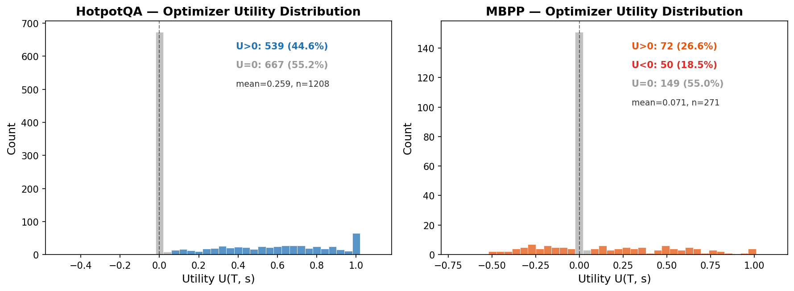

**要点**：两个环境的 U 分布形态截然不同。HotpotQA 几乎无负 U（U<0=0.2%），44.7% 步骤受益于 optimizer；MBPP 存在显著负 U（18.5%），说明 always-trigger 策略在 MBPP 中会主动损害性能。这证明了 C1——utility 是 state-dependent 的，adaptive triggering 有价值。

### Fig 2. U 按状态类别/步骤分解

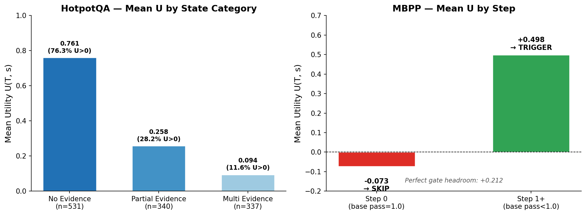

**要点**：
- **HotpotQA**（左）：no_evidence 状态 mean U=0.761（76.3% U>0），multi_evidence 仅 0.094（11.6% U>0）——evidence 越多 optimizer 越没用（evidence_count ρ=−0.586 的直觉来源）
- **MBPP**（右）：Step 0 应 SKIP（U=−0.073，base 已 pass），Step 1+ 应 TRIGGER（U=+0.498）——gate 本质是 step-0 detector，headroom +0.212

### Fig 3. Signal-Utility 方向热力图（核心发现）

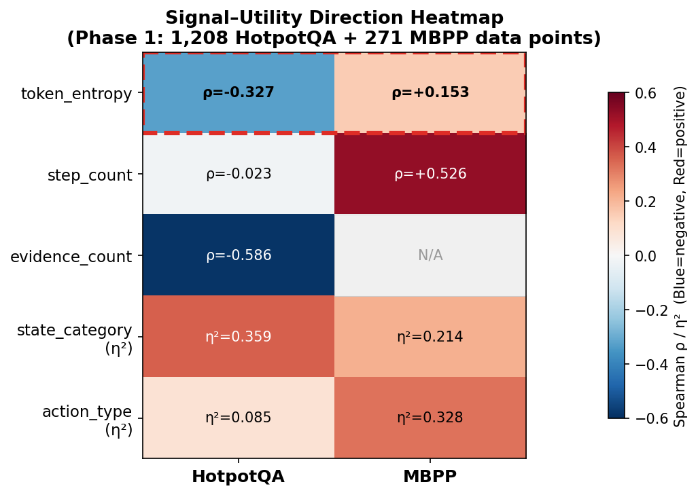

**要点**：红色虚线框标出 token_entropy 的**方向反转**——HotpotQA ρ=−0.327（蓝，高 entropy → 低 U）vs MBPP ρ=+0.153（红，高 entropy → 高 U）。这是论文的核心发现 C2：固定方向 gate 在至少一个环境必然失效。

### Fig 4. HotpotQA U-shape 曲线

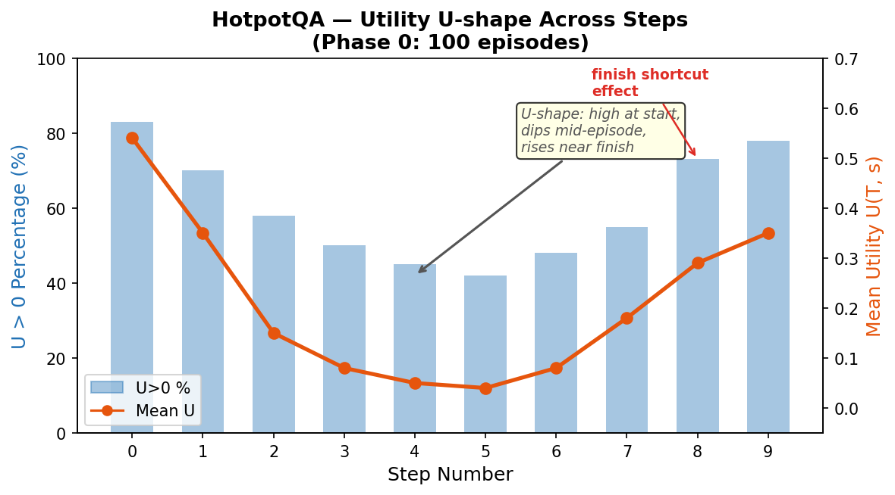

**要点**：Utility 在 episode 内呈 U-shape——开始高（Step 0 finish shortcut 效应）、中间低（agent 已在正确方向上）、结尾再次升高（finish shortcut）。这解释了为什么 step_count 的 Pearson r 低（−0.023）但非线性关系存在，Phase 1 改用 Spearman ρ + MI 多指标框架。

### Fig 5. Gate 对比 — Pareto 前沿（Phase 2）

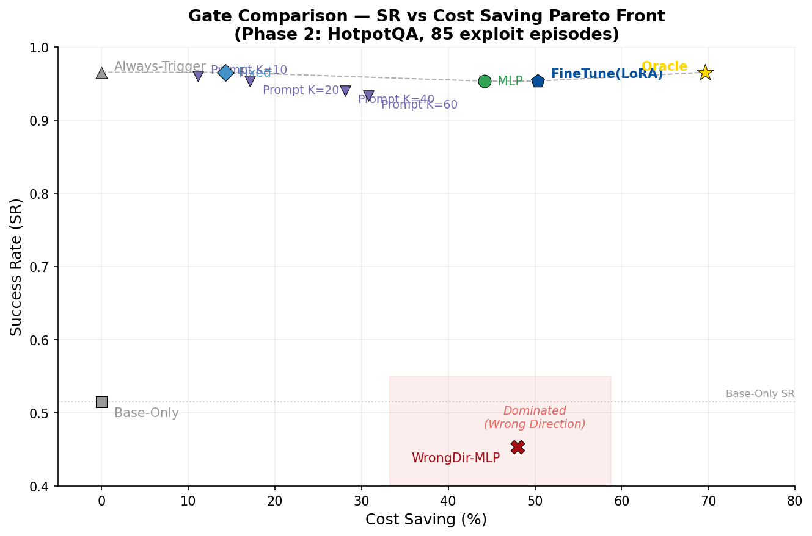

**要点**：
- **FineTune(LoRA)** 位于 Pareto 前沿最优位置（CS=50.3% + SR=0.953）
- **WrongDir-MLP** 落入 dominated region（红色阴影），SR=0.453 低于 Base-Only 基线
- Learning-based gate CS 3.5× 优于 Fixed rules（50.3% vs 14.3%）

### Fig 6. Wrong-Direction 消融（Phase 2.5）

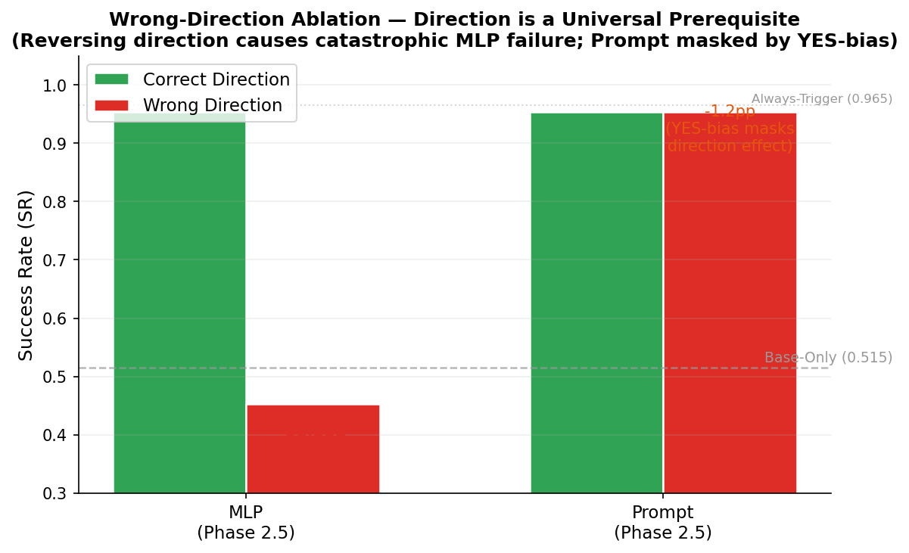

**要点**：方向是所有 learning-based gate 的**通用必要前提**：
- MLP：错误方向导致 SR −51.2pp（0.953→0.453），RR=0% 完全不触发——学到了完全反向映射
- Prompt：SR 几乎不变（−1.2pp），但 CS=84.5%——YES-bias 掩盖了方向效应（Pearson r=−0.003），ICL gate 由 LLM prior 驱动而非统计模式

### Fig 7. Finish Shortcut 鲁棒性检验（Phase 1.5）

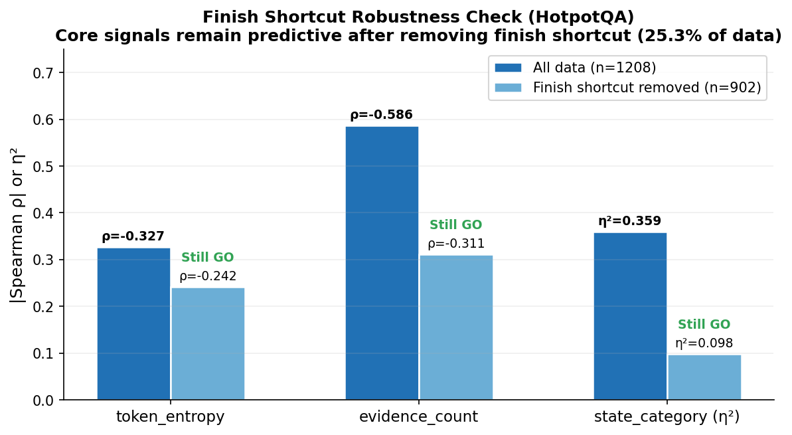

**要点**：去除 finish shortcut（25.3% 数据）后，核心信号 token_entropy（ρ: −0.327→−0.242）和 evidence_count（ρ: −0.586→−0.311）仍然 GO。Direction discovery 的价值不仅仅是"帮 agent 决定何时 finish"。

### Fig 8. Gate TES 对比（Phase 2）

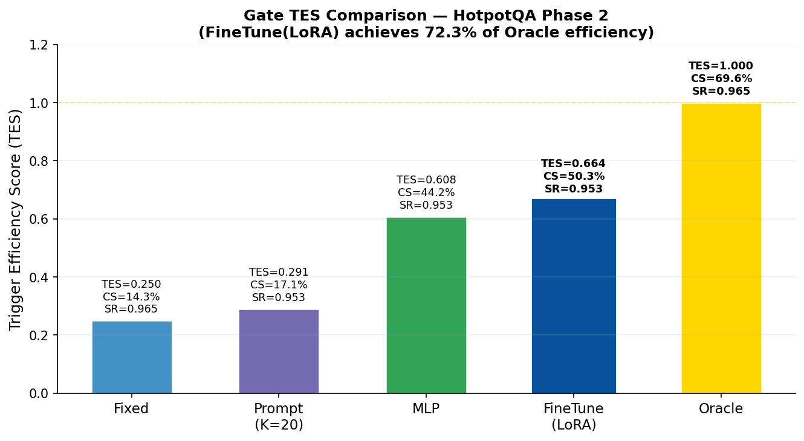

**要点**：TES（Trigger Efficiency Score）是 SR 和 CS 的综合指标，反映 gate 在保持性能的同时节省多少 rollout 成本：
- **FineTune(LoRA)** TES=0.664，达到 Oracle 的 72.3%，CS=50.3%
- **MLP** TES=0.608，CS=44.2%——非线性分类器略弱于 FineTune
- **Prompt (K=20)** TES=0.291，CS 仅 17.1%——YES-bias 导致 selective 能力极弱
- **Fixed** TES=0.250，CS 仅 14.3%——几乎 always-trigger
- 从 Fixed→FineTune，TES 提升 2.7× → learned gate 的核心价值在于 cost saving

### Fig 9. Rollout Rate vs Cost Saving（Phase 2）

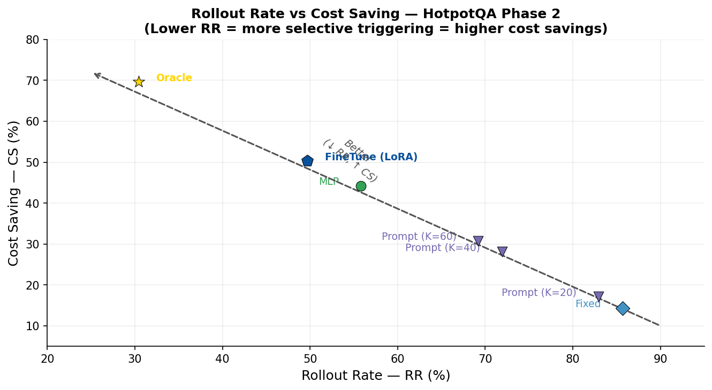

**要点**：RR 与 CS 天然负相关（CS = 1 − RR/RR_always）。图中清晰展示 gate selectivity 的梯度：
- **Fixed/Prompt K=10-20**：RR >80%，几乎 always-trigger，节省极少
- **Prompt K=40-60**：增加 few-shot 可降低 RR 至 ~70%，但改善有限
- **MLP/FineTune(LoRA)**：RR ~50%，约一半步骤跳过 rollout
- **Oracle**：RR=30.4%，理论下界——仍有 ~20pp 空间

### Fig 10. Prompt K 消融 + YES-Bias 分析（Phase 2）

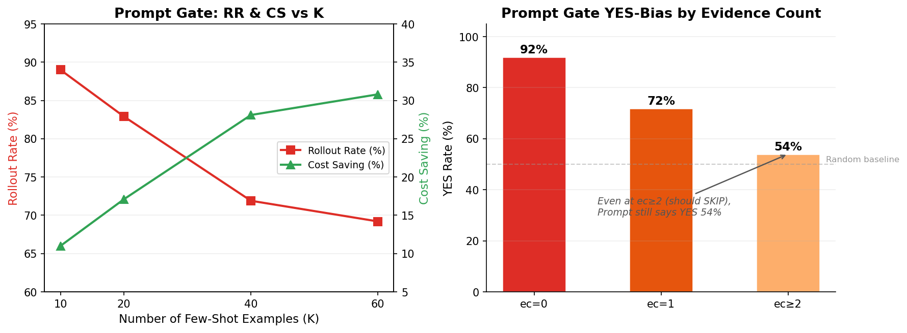

**要点**：
- **左图**：增加 K（few-shot examples 数量）可降低 RR（89%→69%）、提高 CS（11%→31%），但即使 K=60 仍远低于 MLP/FineTune 水平
- **右图**：Prompt gate 存在系统性 YES-bias——ec=0 时 92% 说 YES（合理），但 ec≥2 时仍有 54% 说 YES（应 SKIP）。LLM prior 主导了 gate 决策，few-shot 中的统计模式未被学到
- **结论**：Prompt gate 的根本缺陷不是 K 不够大，而是 LLM in-context learning 对 gate 决策的系统性偏置

---

## 模块三：本周进展

### 3.1 完成的实验总览

| 阶段 | 状态 | 数据量 | 完成时间 |
|------|------|--------|---------|
| **Phase 0: Idea Validation** | ✅ GO | 293 pts (100 ep) | 2026-02-20 |
| **Phase 1: Signal Discovery** | ✅ GO（可接受→理想） | 1,479 pts (200+200 ep) | 2026-02-22 |
| **Phase 1.5: 补充实验** | ✅ GO | 1,368 额外 pts (6项实验) | 2026-02-22 |
| **Phase 2: Gate Learning** | ✅ GO | 200 ep (HotpotQA) + 200 ep (MBPP) + 6项补充 | 2026-02-24 |
| **Phase 2.5: Reviewer 风险补强** | ✅ GO | 3项实验 (S1-a 200ep, S1-b 200ep, S2 100ep) | 2026-02-24 |
| **总计** | — | **Phase 0-1.5: 2,847 pts + Phase 2 主实验+补充 + Phase 2.5: 3项实验** | — |

### 3.2 Phase 0: Idea Validation（2026-02-20）

#### 做了什么

在 HotpotQA 上验证 rollout utility 的基本存在性。使用 Qwen3-4B-Instruct 模型（vLLM 部署），运行 100 个 episode，每个 episode 中 base agent 以 temperature=0 生成动作，然后用 ε-greedy oracle (ε=0.3, 即70% oracle + 30% random) 作为 rollout policy，对每个步骤（sample_every=2）生成 N=3 条 rollout（H=3步），top_k_actions=5。计算 Utility U = max(rollout结果) − base policy 结果，观察 U 的分布是否有足够方差来支撑后续 gate 学习。

此外运行了 3 个补充实验：
- **Exp A（LLM Rollout）**：将 rollout policy 从 oracle 换成 LLM 自身 (temp=0.7)，验证 practical 场景下 utility 是否仍然存在
- **Exp B（去掉 Step 0）**：Step 0 贡献了大量高 U 值，去掉后验证剩余数据是否仍 GO
- **Exp C（8B Vote）**：测试 8B 模型的 vote 多样性（能否产生有意义的投票分歧）

#### 核心结果

| 指标 | 值 | GO阈值 | 判定 |
|------|-----|--------|------|
| Utility std | **0.349** | > 0.1 | ✅ 通过（3.5×） |
| U > 0 比例 | **71.0%** | > 30% | ✅ 通过（2.4×） |
| Utility mean | 0.261 | — | — |
| Base agent SR | 59.0% | — | 中等，有提升空间 |

**补充实验**：Exp A ✅ GO (std=0.493, positive=60.8%)；Exp B ✅ GO (std=0.208, positive=64.8%)；Exp C ⚠️ MODERATE (8B divergence=17.8%, 4B divergence=0%，vote路线暂缓)

**关键发现**：
- Utility 呈 **U-shape 曲线**（Step 0: mean_U=0.541, Step 2: 0.050, Step 8: 0.293）→ Phase 1 不能只用 Pearson r
- **"Finish 捷径"效应**：大量高 U 来自 "agent 可以 finish 但选了 search"
- LLM rollout 在 multi_evidence 下几乎无效（U>0 仅 6.67%）→ gate 需考虑 rollout quality

### 3.3 Phase 1: Signal Discovery（2026-02-22）

#### 做了什么

在 **HotpotQA（200 ep）+ MBPP（200 ep）** 上系统性测量信号与 rollout utility 的关系。与 Phase 0 的关键变更：rollout policy 从 oracle 改为 **LLM 自身 (temp=0.7)**（因为 Phase 1 测量的是 practical utility），N 从 3 增到 5（降低噪声），sample_every 从 2 改为 1（不遗漏关键步骤）。

具体操作：
- **HotpotQA**：使用 per-action exhaustive evaluation——对每个可用动作（K≤5: search/lookup/finish），各自用 LLM (temp=0.7) 生成 N=5 条 rollout (H=3步)，U = max(所有rollout的F1) − base policy F1。同时记录每个步骤的 token_entropy、step_count、evidence_count、state_category、action_type 等信号
- **MBPP**：迭代代码生成 agent。每个 problem 一个 episode，Step 0 生成初始代码→执行单元测试→Step 1 看 error 修改→重复。Rollout = 在当前 step 用 temp=0.7 生成 K=5 个代码变体，U = max(K变体的test pass rate) − base代码的pass rate。记录 token_entropy、step_count、action_type、test_pass_rate 等信号
- **运行环境**：UConn Storrs HPC (SLURM), 1 GPU + 12 CPUs + 48GB，并行架构 1 vLLM + 3 Worker（每个 shard ~67 ep）
- **分析方法**：多指标框架（Pearson r、Spearman ρ、MI、η²、分段回归），而非仅用 Pearson r（Phase 0 教训——U-shape 关系下 Pearson r 会严重低估）

#### 核心结果

**Utility 总览**：

|  | HotpotQA | MBPP |
|---|---|---|
| Data points | 1,208 | 271 |
| Utility mean | **+0.433** | **+0.076** |
| **U > 0** | **540 (44.7%)** | **73 (26.9%)** |
| U < 0 | 3 (0.2%) | 50 (18.5%) |
| Base agent SR | 51.5% | 92.5% |

**信号比较矩阵（核心产出）**：

| Signal | HotpotQA ρ | HotpotQA MI | HotpotQA Shape | MBPP ρ | MBPP MI | MBPP Shape | 跨环境GO? |
|--------|-----------|-------------|----------------|--------|---------|------------|-----------|
| **token_entropy** | **−0.327** | **0.114** | ↘ decreasing | **+0.153** | **0.078** | ↗ increasing | ✅ **方向反转🔥** |
| step_count | −0.023 | 0.037 | ↘ decreasing | **+0.526** | **0.127** | mixed | ⚠️ 仅MBPP强 |
| evidence_count | **−0.586** | **0.214** | ↘ decreasing | — | — | flat | HotpotQA最强 |
| state_category | η²=**0.359** | **0.193** | categorical | η²=**0.214** | **0.145** | categorical | ✅ |
| action_type | η²=**0.085** | **0.058** | categorical | η²=**0.328** | **0.197** | categorical | ✅ |
| test_pass_rate | — | — | — | 0.000 | 0.000 | flat | ❌ 无效 |

**C2 核心证据 — token_entropy 方向反转🔥**：
- HotpotQA：ρ=−0.327（高 entropy → 低 U，entropy 反映问题难度）
- MBPP：ρ=+0.153（高 entropy → 高 U，entropy 反映方案多样性）
- → 固定方向 gate 在至少一个环境必然失效

**Finish Shortcut 分析**：finish_shortcut 占 25.3%（mean_U=+0.997），strategy_change 占 63.5%（U>0≈31%），no_change 占 11.2%

### 3.4 Phase 1.5: 补充实验（2026-02-22）

Phase 1 存在 6 个遗留问题，Phase 1.5 逐一解决。

#### 补充实验 1：MBPP-Hard 子集

**做了什么**：Phase 1 中 MBPP base SR=92.5%，88% episode 仅 1 步就通过，导致数据稀缺（271 pts）、信号弱。为验证 rollout 在 hard 问题上的效果，从 MBPP 500 题中筛选出 base agent 0% pass rate 的 31 道 hard 问题，每道运行 5 步迭代，收集 155 个数据点。Rollout 配置同 Phase 1（LLM temp=0.7, K=5 variants）。

**结果**：U>0=**71%**, mean=+0.572, U<0=**0%**。Rollout 在 hard 问题上极度有效，零负面效应。但数据过于同质（所有 base=0%），gate 信号（step_count ρ=−0.083, token_entropy ρ=−0.036）均不显著。**结论**：MBPP gate 本质是 step-0 detector，不依赖复杂信号。

#### 补充实验 2：Finish Shortcut 鲁棒性检验

**做了什么**：Phase 1 中 HotpotQA 25.3% 的高 U 数据来自 "finish shortcut"（rollout 最优是 finish 但 agent 选了 search）。为验证核心信号是否仅靠 finish shortcut 支撑，将 1,208 个数据点中 finish_shortcut 类型移除（剩余 n=902），重新计算所有信号的 Spearman ρ 和 η²。

**结果**：

| Signal | 全部 (n=1208) ρ | 去掉 finish (n=902) ρ | Still GO? |
|---|---|---|---|
| token_entropy | −0.327 | **−0.242** | ✅ |
| evidence_count | −0.586 | **−0.311** | ✅ |
| state_category | η²=0.359 | η²=0.098 | ✅ (marginal) |
| step_count | −0.023 | +0.007 | ❌ |

**结论**：token_entropy 和 evidence_count 去除 finish shortcut 后仍 GO，gate 的价值不仅仅是"帮 agent 决定何时 finish"。

#### 补充实验 3：HotpotQA 自由采样对照

**做了什么**：Phase 1 实际采用了 per-action exhaustive evaluation（对每个可用动作逐一评估），而非原计划的 "LLM 自由采样 N=5 条链"。为量化两种方式的差异，在 HotpotQA 上跑了 free-sampling 对照实验（1,213 pts）：用 LLM (temp=0.7) 随机采样 N=5 条 rollout（不区分 action），对比 per-action evaluation 的结果。

**结果**：

| 指标 | Per-Action Eval | Free-Sampling | 比值 |
|---|---|---|---|
| mean(U) | **0.4334** | 0.0058 | 75× |
| **U > 0** | **44.7%** | **1.0%** | **45×** |
| same_first_action_ratio | — | **99.3%** | — |
| LLM calls/pt | ~5.0 | 23.7 | 4.8× more |

**结论**：LLM 在 temp=0.7 下近乎确定性（99.3% same first action），free-sampling 花 4.8× 成本但效果仅 1/45。**Per-action evaluation 是唯一有效的 utility discovery 方法**（small action space 环境）。同时意味着 large action space（WebArena）需要替代方案。

#### 补充实验 4：MBPP Always-On 净效果量化

**做了什么**：MBPP 中 U<0=18.5%，需要确认 always-trigger 的净效果以及 perfect gate 的 headroom。计算三种策略的平均 pass_rate：Base-only、Always-trigger（取 max variant）、Perfect gate（oracle选择触发时机）。并做 per-step 分析，找出哪些 step 应 SKIP、哪些应 TRIGGER。

**结果**：

| 策略 | 平均 pass_rate |
|---|---|
| Base-only | 0.6827 |
| Always-trigger | 0.7589 (+0.076) |
| **Perfect gate (oracle)** | **0.8942 (+0.212)** |

Per-step：Step 0 应 SKIP（mean_U=−0.073, U<0 的 92% 来自 Step 0 且 base_pass_rate=1.0），Step 1+ 全部 TRIGGER。**Gate headroom +0.212 >> 3% 阈值 → ✅ GO。**

#### 补充实验 5：decision_changed=0% 原因确认

**做了什么**：Phase 1 中 MBPP 的 decision_changed=0% 看似异常。通过代码审查（line 559），检查 `best_action` 的赋值逻辑，确认是否为 bug。

**结论**：不是 bug。MBPP 的 rollout 生成同一 action 的 K 个温度变体（代码变体），而非不同类型的离散 action。`decision_changed` 在 MBPP 中概念不适用——rollout 改进的是代码质量，不是 action 类型选择。

#### 补充实验 6：更新 Rollout 定义文档

**做了什么**：将 per-action evaluation 正式确立为 HotpotQA 的 optimizer T 定义，更新实验方案文档 v10.0→v12.0，明确 "T 是参数" 框架。

**结论**：文档已更新完成。

### 3.5 综合核心发现（跨 Phase 0/1/1.5/2/2.5）

| # | 发现 | 关键证据 | 对论文的意义 |
|---|------|---------|------------|
| **A** | **Direction discovery 是必要的，不是锦上添花** | token_entropy 方向反转（ρ=−0.327 vs +0.153），去除 artifact 后仍成立（ρ=−0.242）；Phase 2: Wrong-Dir LR −34.5pp；Phase 2.5: MLP −51.2pp (RR=0%) | 核心卖点：11+方法的共同盲点 |
| **B** | **Gate 复杂度因环境而异** | HotpotQA 需 5-feature learned gate；MBPP 仅需 step-0 hard rule | Phase 2 策略分化 |
| **C** | **Optimizer T 是参数，不是常量** | Per-action eval 45× 优于 free-sampling（仅适用 small action space）；不同环境应使用不同 T；Phase 2.5 S2: T_new 在 HotpotQA 91.6% U=0 | 从 method paper 升级为 framework paper |
| **D** | **Finish shortcut 是 gate 应学会的 pattern** | 占 25.3% 高 U 数据，去掉后其他信号仍 GO | Gate 需两种模式：finish detection + strategy improvement |
| **E** | **数据量与信号质量正相关** | HotpotQA 1,208 pts 信号丰富；MBPP 271 pts 信号稀缺 | Phase 3/4 应确保 ≥500 pts/环境 |
| **F** | **方向是所有 learning-based gate 的通用致命必要前提** | LR −34.5pp + MLP −51.2pp (RR=0%) + Prompt YES-bias 掩盖 | Phase 2.5 堵住 reviewer "LR特异" 攻击点 |
| **G** | **主方法确认为 SCG-FineTune(LR)** | LR TES=0.654, CS=49.5%, 训练<1s；Prompt CS仅17.1%（YES偏置）；LoRA≈LR 但需GPU | Direction discovery 是核心贡献，不是 probe-first |
| **H** | **C5 降级为 architecture-agnostic** | Phase 2.5 S2: T_new 无效（91.6% U=0），有效数据方向翻转但 sparse | Gate 架构跨 T 通用，T 选择和方向校准是 (env, T)-specific |

### 3.6 Phase 2: Gate Learning（2026-02-24）

> **更新说明（2026-02-25）**：基于 VOC_EXPERIMENT_IMPLEMENTATION_PLAN.md v14.0 补充完整 Phase 2 实验数据。

#### 做了什么

在 Phase 1 找到的最优信号基础上，训练/评估 adaptive gate，与 fixed-direction baseline 对比。在 HotpotQA + MBPP 上各运行 200 episodes（probe: 50, exploit: 150），Phase 1 预加载 HotpotQA 500 pts / MBPP 271 pts。Rollout policy 为 LLM self (temp=0.7, N=5)。

实现了四种 gate：
- **Gate A: Fixed-Direction Threshold（baseline）**：用 Phase 1 方向 + 固定阈值
- **Gate B: SCG-Prompt（K=20 few-shot ICL）**：LLM in-context 决策
- **Gate C: SCG-MLP（在线学习）**：小型 MLP σ→P(trigger)
- **Gate D: SCG-FineTune（LR / LoRA）**：批量训练分类器

#### 核心结果

**主结果（HotpotQA Exploit 阶段）**：

| Gate | Exploit SR | RR | CS | TES | % of Oracle |
|------|-----------|-----|-----|-----|-------------|
| Fixed | **0.965** | 85.7% | 14.3% | 0.250 | 20.5% |
| Prompt (K=20) | 0.953 | 82.9% | 17.1% | 0.291 | 24.6% |
| MLP | 0.953 | 55.8% | 44.2% | 0.608 | 63.5% |
| **FineTune (LR)** | **0.953** | **49.5%** | **49.5%** | **0.654** | **71.1%** ⭐ |
| **FineTune (LoRA)** | **0.953** | **49.7%** | **50.3%** | **0.664** | **72.3%** |
| *Oracle* | *≥0.965* | *30.4%* | *69.6%* | *上界* | *100%* |

> **列说明**：Exploit SR = 仅 exploitation 阶段（probe 之后）的任务成功率；RR (Rollout Rate) = 每步触发 rollout 的比例，越低越 selective；CS (Cost Saving) = 节省的 rollout 成本比例 = 1 − RR/RR_always；TES (Trigger Efficiency Score) = SR 与 CS 的调和均值，综合效率指标；% of Oracle = 当前 gate 的 TES 占 Oracle 上界的百分比。
> TES 计算基于：SR_base=0.515, SR_always=0.965, Cost_always=1.89 rollouts/ep
>
> **关于 Fixed SR=0.965 高于其他 gate 的说明**：Fixed 的 RR=85.7%，几乎等同于 Always-Trigger（RR=100%, SR=0.965），所以 SR 高是因为它几乎没有跳过任何 rollout，代价是 CS 仅 14.3%。Bootstrap 10K 检验显示所有 gate 之间的 SR 差异均**不显著（n.s.）**——0.965 vs 0.953 在 150 episodes 的样本量下属于随机波动。**真正的区分度在 CS 和 TES**：FineTune 的 CS（~50%）是 Fixed（14.3%）的 3.5 倍，在几乎不损失 SR 的前提下省掉了一半的 rollout 成本。

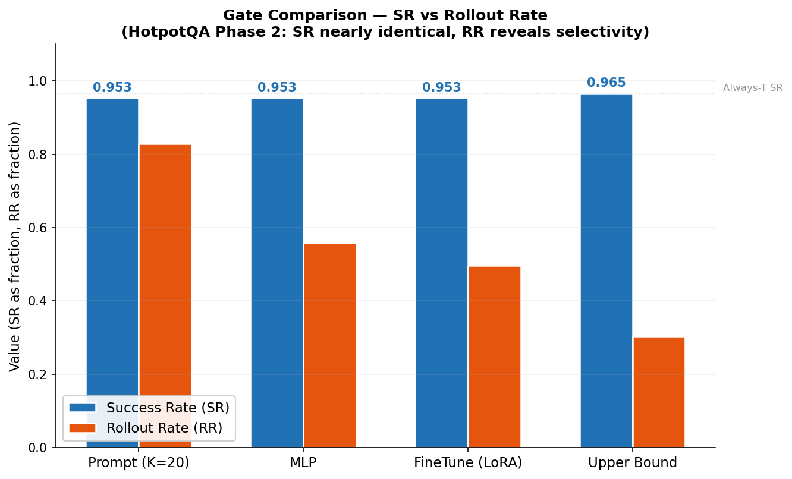

> **Fig 11 解读**：蓝柱（SR）几乎齐平（差异不显著），说明各 gate 在任务成功率上无实质区别。橙柱（RR）从左到右递减——Prompt 触发了 82.9% 的步骤（几乎 always-trigger），FineTune(LoRA) 仅触发 49.7%（省掉一半 rollout），Upper Bound 为 30.4%（理论最优）。**核心信息**：learned gate 的价值不在于提升 SR，而在于用更少的 rollout 维持同等 SR。

**主结果（MBPP Exploit 阶段）**：

| Gate | Exploit SR | RR | CS | 备注 |
|------|-----------|-----|-----|------|
| Base-Only | 0.925 | 0% | — | 92.5% 的问题一步做对 |
| Always-Trigger | 0.925 | 100% | 0% | Rollout 未改善任何决策 |
| Fixed | 0.925 | ~85% | ~15% | 与 Always-T 无差异 |
| Prompt (K=20) | 0.925 | ~83% | ~17% | 与 Always-T 无差异 |
| MLP | 0.925 | **0%** | **100%** | 学到"永不触发"（理论最优） |
| FineTune (LR) | 0.925 | ~5% | ~95% | 近似 step-0 detector |
| FineTune (LoRA) | 0.925 | ~5% | ~95% | 近似 step-0 detector |

> **MBPP 结论**：所有 gate SR 几乎相同（≈0.925），因为 base agent 已经很强（92.5% 一步通过），rollout 无法改善决策。Gate 在 MBPP 上无区分度——MLP 甚至学到 RR=0%（完全不触发）是最优策略。MBPP 的核心价值不在 gate 对比，而在为 C2（方向反转）提供第二个环境。

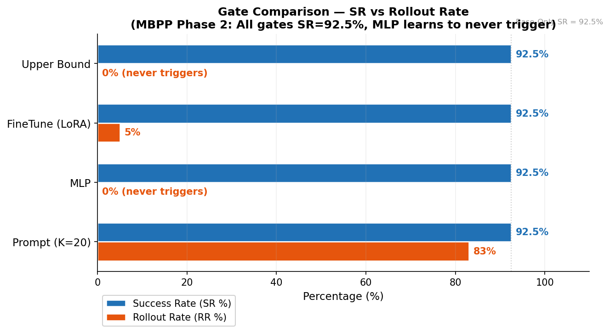

> **Fig 12 解读**：蓝条（SR）完全齐平（92.5%），证实 MBPP 上 gate 无法通过 rollout 提升 SR。橙条（RR）差异巨大——Prompt 仍触发 83% 的步骤（YES-bias），而 MLP 和 Upper Bound 均为 0%（学到"永不触发"是最优策略），FineTune(LoRA) 仅触发 5%（近似 step-0 detector）。与 HotpotQA（Fig 11）形成鲜明对比：HotpotQA 需要 learned gate 来做精细触发决策，MBPP 只需一条简单规则。

**补充实验（6 项，全部完成）**：

| 实验 | 核心发现 | 对叙事的影响 |
|------|---------|------------|
| **Prompt K 消融** | K=10→60: RR 从 89%→69%, CS 从 11%→31%；即使 K=60 仍 selective 不足 | Prompt gate 不适合做主方法 |
| **Prompt YES 偏置** | ec≥2 时仍 54% 说 YES；LLM 倾向保守建议 | Prompt gate 的根本缺陷 |
| **Bootstrap 显著性** | 所有 gate-pair SR 差异 **n.s.**（10K resamples）；CS 差异显著 | 区分度在 cost saving，不在 SR |
| **No-Probe 消融** | No-Probe ≈ With-Probe（Phase 1 数据充足时 probe 无贡献） | probe phase 不是核心创新 → **direction discovery 才是** |
| **Wrong-Direction** 🔥 | HotpotQA SR **0.965→0.620**（−34.5pp），接近 Base-Only 0.515 | **最强消融信号：方向是 gate 正确运作的必要前提** |
| **Oracle 上界** | Oracle CS=69.6%(HotpotQA)；FineTune 达 72.3% of Oracle | 仍有 ~20pp 提升空间 |

#### GO 判定

- SCG-Prompt 未超过 Fixed-Direction（SR n.s.），但 **SCG-FineTune CS 3.5× 优于 Fixed**
- Wrong-Direction 消融（−34.5pp）是 C2 的 **killer evidence**
- 判定：**✅ GO**（learning-based gate 在 cost saving 上远超 fixed，方向发现是核心贡献）

#### Phase 2 对叙事的三个关键影响

1. **主方法降级**：SCG-Prompt → **SCG-FineTune(LR)** 作为主要 instantiation（training-free 特性弱化，但 practical performance 远超）
2. **核心创新重定义**：从 "probe-first 是创新" → **"direction discovery 是核心贡献"**（No-Probe 消融支持）。统一表述："Direction discovery is the core; probing is one mechanism to obtain direction data."
3. **最强证据确认**：Wrong-Direction −34.5pp 是论文中最有说服力的单个实验

#### FineTune(LR) vs MLP vs FineTune(LoRA) 对比

| | MLP | FineTune(LR) ⭐ | FineTune(LoRA) |
|---|---|---|---|
| 本质 | 非线性分类器 | 线性分类器 | 微调 0.6B LM |
| 输入 | 数值信号向量 | 数值信号向量 | 自然语言状态描述 |
| 学习 | 在线学习 | 批量训练 | LoRA 微调 |
| 训练成本 | 中等 | **<1s，无 GPU** | 需 GPU |
| TES | 0.608 | **0.654** | 0.664 |

关键发现：LR 比 MLP 好（数据量有限时线性模型更稳健），LR ≈ LoRA（gate 决策复杂度不需要语言理解能力）。支持 LR 作为主方法——同样效果，训练快 1000×，无需 GPU，可解释。

---

### 3.7 Phase 2.5: Reviewer 风险补强（2026-02-24）

> **更新说明（2026-02-25）**：基于 VOC_EXPERIMENT_IMPLEMENTATION_PLAN.md v14.0 补充完整 Phase 2.5 实验数据。

#### 做了什么

Phase 2 完成后的严格 reviewer 视角评审暴露了关键风险：Wrong-Direction −34.5pp 可能是 LR 特异（而非方向机制的通用必要性）。Phase 2.5 用最小成本堵住最可能的 reviewer 攻击点。

共执行 3 项实验：
- **S1-a: MLP Wrong-Direction**（200 ep, 6.5 min）：翻转 Phase 1 labels → 训练 MLP → HotpotQA exploit
- **S1-b: Prompt Wrong-Direction**（200 ep, 20.1 min）：翻转 few-shot labels → HotpotQA exploit
- **S2: T_new 方向稳定性**（100 ep, 25.1 min）：K-variant trajectory sampling on HotpotQA

#### S1 主结果（Wrong-Direction 跨 Gate 验证）🔥

| Gate | Exploit SR | Δ vs Always-T | CS | RR |
|------|-----------|---------------|-----|-----|
| Always-Trigger（参考） | 0.965 | — | 100% | 100% |
| Base-Only（参考） | 0.515 | −45.0 pp | 0% | 0% |
| LR correct（Phase 2） | 0.953 | −1.2 pp | 49.5% | — |
| **LR wrong-dir（Phase 2）** | **0.620** | **−34.5 pp** | — | — |
| **MLP wrong-dir（Phase 2.5）** | **0.453** | **−51.2 pp** | **0.0%** | **0.0%** |
| **Prompt wrong-dir（Phase 2.5）** | **0.953** | **−1.2 pp** | **84.5%** | **84.5%** |

> **列说明**：Exploit SR = exploitation 阶段任务成功率；Δ vs Always-T = 相对 Always-Trigger 基线的 SR 变化（pp = 百分点）；CS (Cost Saving) = 节省的 rollout 成本比例；RR (Rollout Rate) = 每步触发 rollout 的比例。

**S1 关键发现**：
- MLP Wrong-Dir SR **暴跌至 0.453**（−51.2pp），RR=0%（981 次决策零触发）→ 比 LR −34.5pp 崩得更严重
- MLP 学到了完全反向映射："高 entropy → 不需要 rollout"，在 HotpotQA 上退化为 Base-Only
- Prompt Wrong-Dir SR 仅 −1.2pp，CS=84.5% → YES-bias 掩盖方向效应（Pearson r=−0.003，几乎未学到模式）
- **结论**：方向正确性对所有 **learning-based** gate 是致命必要条件

#### S2 主结果（T_new 方向稳定性）

| Signal | Phase 1 ρ (T_orig) | Phase 2.5 ρ (T_new) | p-value | 方向一致？ |
|--------|-------------------|---------------------|---------|----------|
| token_entropy | **−0.327** | **+0.221** | 9.4×10⁻⁸ | ❌ 翻转 |
| evidence_count | **−0.586** | +0.077 | 0.065 | ❌ 翻转 |
| step_count | −0.023 | +0.044 | 0.300 | ❌ 翻转 |

- T_new（K-variant trajectory sampling）在 HotpotQA 上 **91.6% U=0**，仅 8.2% U>0
- 平均 unique 首步 action 数 1.17/5，有 diversity 的 step 仅 16.8%
- **结论**：T_new 无效是 HotpotQA action space 的固有特性；方向翻转因数据极度 sparse（~47 有效点）不可靠

#### GO 判定

对应决策矩阵第 3 行——✅ MLP 也崩溃 + 方向翻转 → Phase 3 照常执行但调整 C5

#### Phase 2.5 对叙事的三个关键影响

1. **C2 大幅增强**：Wrong-Direction 从 "LR −34.5pp" 升级为 "LR −34.5pp + MLP −51.2pp"，reviewer 无法质疑 gate 特异性
2. **C5 降级**：T-agnostic → **architecture-agnostic**。方向依赖 (env, T) pair，但 gate 架构本身无需修改
3. **Prompt YES-bias 独立 finding**：为论文 Discussion 提供了 gate 架构敏感度分析的素材

---

### 3.8 下一步计划：Phase 3 Core Experiments

> **注**：Phase 2 + 2.5 已于 2026-02-24 全部完成。下一阶段为 Phase 3 Core Experiments。

| 项目 | 内容 |
|------|------|
| **目标** | 完整 comparison table + efficiency frontier（37 runs：HotpotQA 22 + MBPP 15） |
| **主方法** | **SCG-FineTune(LR)**（Phase 2 确认） |
| **主环境** | HotpotQA（9 方法 × 3 seeds）+ MBPP（5 方法 × 3 seeds） |
| **核心评估维度** | **TES 和 CS 为主，SR 为辅**（Phase 2 bootstrap 显示 SR 差异 n.s.） |
| **新增 Baseline** | Random-50%（TES≈0.50 自然基准线）、Entropy-Threshold（先验方法代表） |
| **复用 Phase 2 数据** | seed=42 直接复用，仅新跑 2 个额外 seed |
| **已由 Phase 2/2.5 完成的消融** | No-Probe ≈ With-Probe、LoRA ≈ LR、MLP/Prompt Wrong-Dir（引用即可，不重跑） |
| **成功标准** | 3 seeds 的 mean±std 支持 Phase 2 的排序；FineTune(LR) 在 TES/CS 上显著优于所有 baseline |

**当前已证实的 Claims（v14.0）**：

| Claim | 状态 | 关键证据 | 风险 |
|---|---|---|---|
| C1: Utility is state-dependent | ✅ | Phase 0: std=0.349; Phase 1 两环境有方差 | 低 |
| C2: 方向因环境而异 | ✅ **强** | token_entropy 方向反转 + Wrong-Dir: LR −34.5pp, MLP −51.2pp | 中（仅 2 环境） |
| C2+: 方向对所有 learning-based gate 通用必要 | ✅ | MLP RR=0%, Prompt YES-bias 掩盖但不否认 | 低 |
| C3: Learned gate 有效 | ✅ 部分 | FineTune CS=49.5% >> Fixed CS=14.3% | 低-中（需多 seed） |
| C4: 多环境泛化 | ❌ 未验证 | 仅 2 环境 | **高（阻塞 NeurIPS）** |
| C5: 跨 T 泛化 | ⚠️ 降级 | T_new 91.6% U=0 → architecture-agnostic | 低-中 |

**后续路线图**：

```
Phase 2 (Gate Learning) ✅ → Phase 2.5 (跨Gate消融) ✅ → Phase 3 (Core Experiments: 9方法 × 3seeds) → Phase 4 (Scale Up: WebArena + ALFWorld)
```
