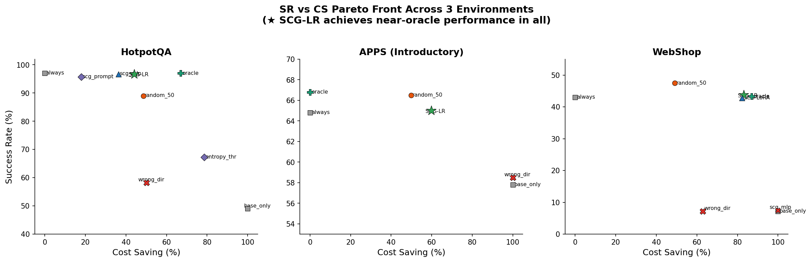
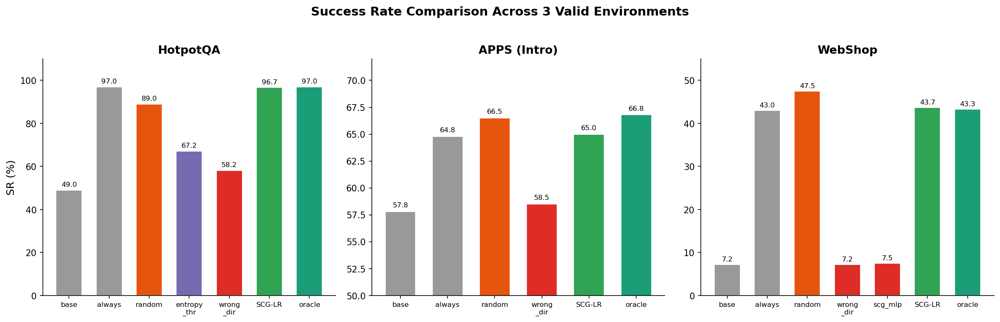
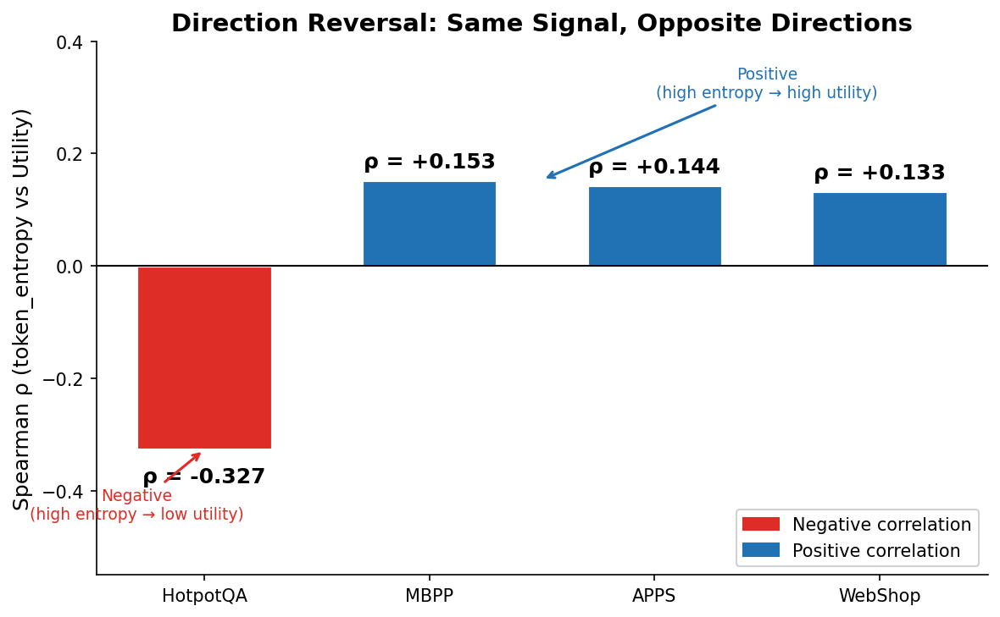
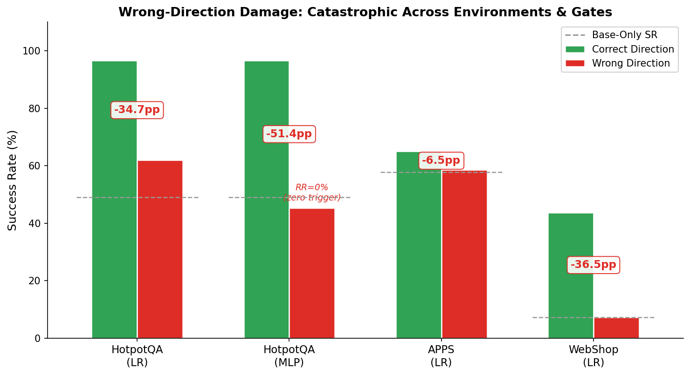
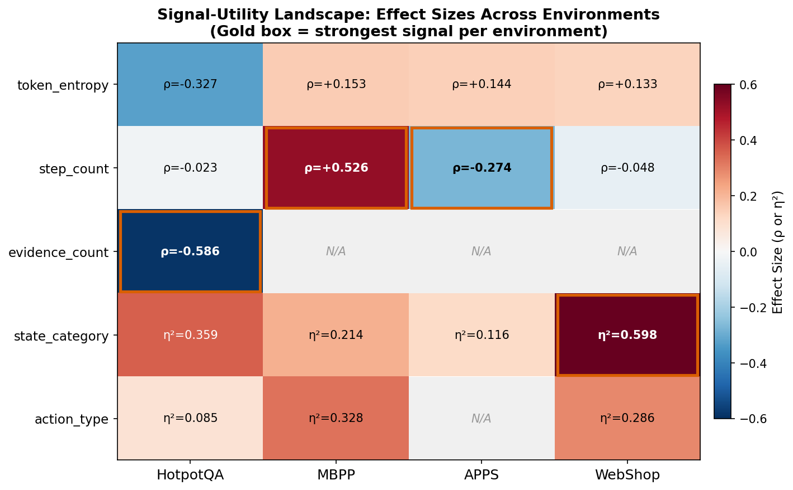
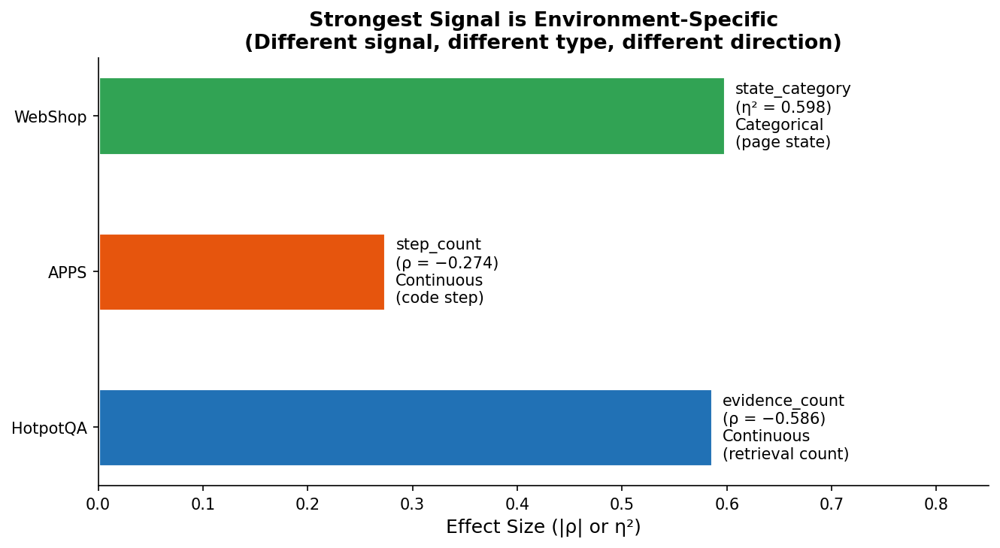
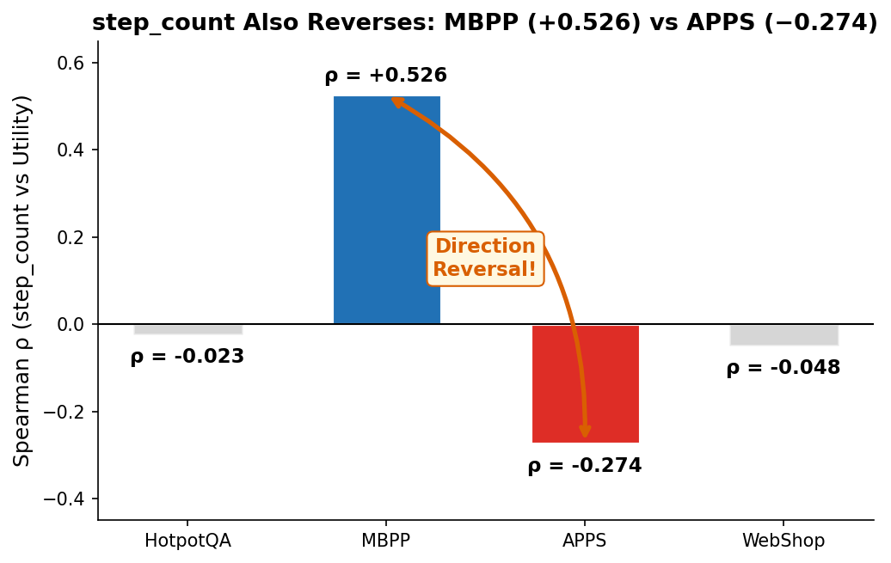

# 本周工作汇报（2026-03-02）

**项目**: Direction-Aware Gate — Adaptive Test-Time Optimizer Triggering
**目标会议**: NeurIPS 2026（主投）/ ICLR 2027（备投）
**核心问题**: For any test-time optimizer T, can we learn WHEN to use it?
**当前状态**: Phase 0-4 全部完成，Phase 5 方案已制定，准备实施

### 术语与缩写

| 缩写 | 全称 | 含义 |
|------|------|------|
| **SR** | Success Rate | 任务成功率 |
| **CS** | Cost Saving | 成本节省 = 1 − RR/RR_always |
| **RR** | Rollout Rate | 每步触发 rollout 的概率 |
| **TES** | Trigger Efficiency Score | SR 与 CS 的调和均值 |
| **U** | Optimizer Utility | rollout 相对 base policy 的改进量 |
| **T** | Test-time Optimizer | 环境特定的优化器 |
| **ρ** | Spearman's rho | 秩相关系数 |
| **η²** | Eta-squared | 分类变量效应量 |

---

## 1. 全环境实验数据总览

### 1.1 环境概览与 Optimizer T 设计

| 环境 | 模型 | Action Space | Optimizer T | 论文角色 |
|------|------|-------------|-------------|---------|
| **HotpotQA** | Qwen3-4B | 小（search/lookup/finish, K≤5） | Per-action evaluation | 主实验（信号最强） |
| **APPS (Intro)** | Qwen3-4B | 单一（代码生成） | K-variant generation (K=5) | 第二有效环境 |
| **WebShop** | Qwen3-4B | 中等（search/click/buy） | LLM-Propose-K (K=5, H=3, env.deepcopy) | 第三有效环境 |
| **ALFWorld** | Qwen3-8B | 中等离散（pick/put/open/go） | LLM-as-Simulator / Batch Scoring | 边界结果（❌ NO-GO） |
| **HumanEval** | Qwen3-4B | 单一（代码生成） | K-variant generation | Ceiling analysis |
| **MBPP** | Qwen3-4B | 单一（代码生成） | K-variant generation | Ceiling analysis / 方向反转证据 |

### 1.2 Base vs Always-Trigger 对比（所有环境）

| 环境 | Base SR | Always SR | Δ (lift) | 判定 |
|------|--------:|----------:|---------:|:----:|
| **HotpotQA** | 49.0% | 97.0% | **+48.0pp** | ✅ GO |
| **APPS (Intro)** | 57.8% | 64.8% | **+7.0pp** | ✅ GO |
| **WebShop** | 7.2% | 43.0% | **+35.8pp** | ✅ GO |
| ALFWorld v3 | 30.0% | 20.0% | −10.0pp | ❌ NO-GO |
| HumanEval | 92.1% | 92.3% | +0.2pp | Ceiling |
| MBPP | 92.7% | 92.7% | +0.0pp | Ceiling |

### 1.3 Gate 方法完整对比（3 个有效环境，3 seeds）

#### HotpotQA（主实验，10 methods × 3 seeds × 200 ep）

| Method | SR (mean±std) | RR (%) | CS (%) | TES |
|--------|:-------------:|:------:|:------:|:---:|
| base_only | 49.0±1.9% | 0.0 | 100.0 | 0.000 |
| always_trigger | 97.0±0.4% | 100.0 | 0.0 | 0.000 |
| random_50 | 89.0±0.8% | 51.4 | 48.6 | 0.614 |
| entropy_threshold | 67.2±3.3% | 21.5 | 78.5 | 0.509 |
| best_sigma_correct | 97.0±0.4% | 87.0 | 13.0 | — |
| **best_sigma_wrong** ❌ | **58.2±2.5%** | 49.9 | 50.1 | 0.277 |
| scg_prompt | 95.7±0.5% | 82.1 | 17.9 | — |
| scg_mlp | 96.7±0.6% | 63.7 | 36.3 | — |
| **scg_finetune_lr** ⭐ | **96.7±0.6%** | **55.9** | **44.1** | **0.609** |
| oracle | 97.0±0.4% | 33.0 | 67.0 | 0.802 |

**关键**: SCG-LR Pareto-dominates random（SR 96.7% >> 89.0%, CS 相当）。Wrong-direction SR 暴跌至 58.2%（−38.8pp vs correct）。

#### APPS Introductory（第二有效环境，6 methods × 3 seeds × 200 ep）

| Method | SR (mean±std) | RR (%) | CS (%) | TES |
|--------|:-------------:|:------:|:------:|:---:|
| base_only | 57.8±0.5% | 0.0 | 100.0 | 0.000 |
| always_trigger | 64.8±1.2% | 100.0 | 0.0 | 0.000 |
| random_50 | 66.5±0.7% | 50.2 | 49.8 | 0.665 |
| **best_sigma_wrong** ❌ | **58.5±0.0%** | 0.0 | 100.0 | 0.174 |
| **scg_finetune_lr** ⭐ | **65.0±0.8%** | **40.2** | **59.8** | **0.748** |
| oracle | 66.8±0.9% | 100.0 | 0.0 | 0.000 |

**关键**: TES_LR (0.748) > TES_random (0.665), p=0.001 ✅。Wrong-direction gate 完全不触发（RR=0%）——被动放弃模式。

#### WebShop（第三有效环境，8 methods × 3 seeds × 200 ep）

| Method | SR (mean±std) | RR (%) | Precision (%) | TES |
|--------|:-------------:|:------:|:-------------:|:---:|
| base_only | 7.2±1.4% | 0.0 | — | 7.2 |
| always_trigger | 43.0±5.1% | 100.0 | 12.9 | 21.5 |
| random_50 | 47.5±6.3% | 50.9 | 21.9 | 31.5 |
| **best_sigma_wrong** ❌ | **7.2±1.6%** | 37.1 | 0.0 | 5.2 |
| scg_mlp ❌ | 7.5±2.2% | 0.0 | — | 7.5 |
| **scg_finetune_lr** ⭐ | **43.7±5.8%** | **16.9** | **75.1** | **37.3** |
| scg_finetune (LoRA) | 42.8±5.7% | 17.7 | 72.4 | 36.4 |
| oracle | 43.3±4.0% | 13.1 | 100.0 | 38.3 |

**关键**: SCG-LR SR ≈ oracle（43.7% vs 43.3%），precision 75.1%，6× 计算效率（RR=16.9%）。这是 best case——gate 精准到接近理论上界。





#### ALFWorld（❌ NO-GO 边界结果）

| 实验版本 | Base SR | AT SR | Δ | 失败机制 |
|---------|---------|-------|---|---------|
| v2 LLM-as-Simulator | 38.0% | 36.0% | −2.0pp | 想象错误 + 死循环 + 幻觉评分 |
| v3 Batch Scoring | 30.0% | 20.0% | −10.0pp | Confirmation bias（proposed 2.9/10 vs best 6.6/10） |

**贡献**: Rollout 质量层级——env.deepcopy() (WebShop ✅) > deterministic eval (HotpotQA/APPS ✅) > LLM simulation/scoring (ALFWorld ❌)

### 1.4 Wrong-Direction 消融汇总（跨环境 + 跨 Gate）

| 环境 | Gate | Correct SR | Wrong SR | Δ SR | Wrong RR | 失效模式 |
|------|------|:----------:|:--------:|:----:|:--------:|---------|
| HotpotQA | LR | 96.7% | 62.0% | **−34.5pp** | — | 主动误触发 |
| HotpotQA | MLP | 95.3% | 45.3% | **−51.2pp** | **0%** | 完全反向（零触发） |
| HotpotQA | Prompt | 95.3% | 95.3% | −1.2pp | 84.5% | YES-bias 掩盖 |
| APPS | LR | 65.0% | 58.5% | **−6.5pp** | **0%** | 被动放弃（零触发） |
| WebShop | LR | 43.7% | 7.2% | **−36.5pp** | 37.1% | 完全失效 |

**结论**: 方向是所有 learning-based gate 的**通用致命必要前提**，跨环境、跨架构一致。

---

## 2. 核心观点一：Signal-Utility Direction 不固定

### 2.1 跨环境 token_entropy 方向对比

**核心发现**: 同一信号（token_entropy）在不同环境中与 optimizer utility 的相关方向**反转**。

| 环境 | token_entropy ρ | 方向 | 解释 |
|------|:--------------:|:----:|------|
| **HotpotQA** | **−0.327** | ↘ 负 | 高 entropy = 困惑/能力不足 → optimizer 无用 |
| MBPP | +0.153 | ↗ 正 | 高 entropy = 方案多样性 → optimizer 有用 |
| APPS | +0.144 | ↗ 弱正 | 与 MBPP 同向 |
| WebShop | +0.133 | ↗ 弱正 | 与 MBPP 同向 |



**含义**: 如果一个方法固定假设 "高 entropy → 需要 optimizer"（如 CoRefine, SEAG, Think Just Enough），它在 HotpotQA 上必然失效——因为 HotpotQA 中高 entropy 恰恰意味着 optimizer 无用。

### 2.2 Direction Reversal 的鲁棒性

去除 finish shortcut（占 HotpotQA 25.3% 高 U 数据）后，方向反转仍成立：

| Signal | 全部 (n=1208) ρ | 去除 finish (n=902) ρ | 变化 | 仍 GO? |
|--------|:---:|:---:|:---:|:---:|
| token_entropy | −0.327 | −0.242 | −26% | ✅ |
| evidence_count | −0.586 | −0.311 | −47% | ✅ |

### 2.3 量化代价：Wrong-Direction 的灾难性后果



---

## 3. 核心观点二：不同环境需要不同的 Signal

### 3.1 跨环境信号矩阵（完整版）

| Signal | HotpotQA ρ/η² | MBPP ρ/η² | APPS ρ/η² | WebShop ρ/η² | 最强环境 |
|--------|:---:|:---:|:---:|:---:|:---:|
| **token_entropy** | ρ=**−0.327** | ρ=+0.153 | ρ=+0.144 | ρ=+0.133 | HotpotQA |
| **step_count** | ρ=−0.023 | ρ=**+0.526** | ρ=**−0.274** | ρ=−0.048 (n.s.) | MBPP / APPS |
| **evidence_count** | ρ=**−0.586** 🏆 | N/A | N/A | N/A | HotpotQA only |
| **state_category** | η²=0.359 | η²=0.214 | η²=0.116 | η²=**0.598** 🏆 | WebShop |
| **action_type** | η²=0.085 | η²=0.328 | N/A | η²=0.286 | MBPP |
| **test_pass_rate** | N/A | 常数 ❌ | 常数 ❌ | N/A | 无 |



### 3.2 每个环境的最强信号完全不同



→ 不仅方向不同，连最有信息量的信号 identity 都不同
→ 甚至信号 TYPE 也不同（连续 vs 分类）
→ 任何预选固定信号的方法在至少一个环境中会丢失关键信息

### 3.3 Signal Replacement 的含义

这个发现从 "direction reversal" 升级为 **"signal-utility landscape is environment-dependent"**：

1. **方向不固定**：token_entropy 在 HotpotQA 负相关，在 MBPP/APPS/WebShop 正相关
2. **最强信号不固定**：QA 靠 evidence_count，代码靠 step_count，Web 靠 state_category
3. **信号类型不固定**：HotpotQA/APPS 的最强信号是连续的，WebShop 的最强信号是分类的
4. **step_count 方向也不固定**：MBPP ρ=+0.526（正）vs APPS ρ=−0.274（负）🔥



→ 预选一个固定信号 + 固定方向的做法（如 AdaptThink, CATTS, CoRefine 等 11+ 方法）在面对新环境时**系统性地脆弱**。

---

## 4. Phase 5 方案：补强 Method Novelty

### 4.1 动机

Phase 0-4 完成后的论文定位评估：

| 维度 | 评分 | 说明 |
|------|------|------|
| Empirical Finding | ⭐⭐⭐⭐⭐ | Direction reversal + signal replacement，零论文报告 |
| Experimental Rigor | ⭐⭐⭐⭐ | 3 有效环境 + 1 边界 + wrong-dir 消融 + 3-seed |
| Method Novelty | ⭐⭐☆☆☆ | LR on 5 手工 feature，reviewer 可能说 "just LR" |

Phase 5 目标：Method Novelty 从 ⭐⭐ 升级到 ⭐⭐⭐⭐，同时解决三个问题：
1. **手工 feature → 自动化**（用 LLM hidden state d=2560 替代 5 维手工信号）
2. **Binary classification → VOC estimation**（更 principled）
3. **Simple LR → 有架构创新的 model**

### 4.2 双轨方案

```
Phase 5 并行探索两条路线：

路线 A：Cascaded Multi-Fidelity Gate
  ┌──────────────────────────────────────────────────┐
  │  L0: 廉价信号 gate              (~60-70% steps)  │
  │  ├─ confident → 直接决策（零额外开销）             │
  │  └─ uncertain ↓                                  │
  │  L1: Hidden-state VOC probe      (~20-30% steps) │
  │  ├─ confident → 决策                              │
  │  └─ uncertain ↓                                  │
  │  L2: Trial rollout               (~5-10% steps)  │
  │  └─ 直接观测 VOC → 决策                           │
  └──────────────────────────────────────────────────┘

  创新：cascade 结构 + uncertainty-driven escalation + VOC estimation
  优势：实用（成本可控）、interpretable（每级处理比例可分析）
  风险：cascade 可能不优于单层 probe

路线 B：In-Context Gating Network (ICGNet)
  ┌──────────────────────────────────────────────────┐
  │  传统: calib data → [训练] → 固定 θ → f(x;θ)     │
  │  ICGNet: f(x, calib_data) → decision             │
  │         一次 forward pass 完成"学习"+决策          │
  │                                                  │
  │  Architecture:                                    │
  │  1. State Projector: h ∈ R^2560 → R^128          │
  │  2. Utility Encoder: U ∈ R → R^128               │
  │  3. Self-Attention over calibration context       │
  │     → 发现 signal-utility pattern（方向、重要性）  │
  │  4. Cross-Attention: query → context → VOC 预测   │
  └──────────────────────────────────────────────────┘

  创新：in-context learning for gating + meta-training 跨环境
  优势：学术新颖性高、换环境只换 context 不换权重（零 re-training）
  风险：3 环境 meta-training 数据可能不够
```

### 4.3 Phase 5 vs 当前版本 vs 竞争方法

| 维度 | 当前 SCG-LR | Phase 5A (Cascade) | Phase 5B (ICGNet) | CATTS | ARPO |
|------|:---:|:---:|:---:|:---:|:---:|
| Feature 来源 | 手工 5 维 | **hidden state d=2560** | **hidden state d=2560** | 手工 vote signals | policy entropy |
| Gate 架构 | LR | **三级 cascade** | **cross-attention** | 单级 threshold | RL MLP |
| 跨环境适应 | per-env LR | cascade 可迁移 | **零 re-training** | per-env grid search | per-env RL |
| Direction Discovery | ✅ | ✅ | ✅ | ❌ | ❌ |
| Method 新颖度 | ⭐⭐ | ⭐⭐⭐ | ⭐⭐⭐⭐ | ⭐⭐ | ⭐⭐⭐ |

### 4.4 预期时间与影响

| 方案 | 共享步骤 | 独立步骤 | 总时间 | NeurIPS 接受概率 |
|------|---------|---------|--------|:---:|
| 当前 (LR) | — | — | 已完成 | 65-75% |
| 5A (Cascade) | Hidden state 基础设施 (2-3d) | L0/L1/L2 实现 + 集成 (5-7d) | ~2 周 | 70-80% |
| 5B (ICGNet) | Hidden state 基础设施 (2-3d) | 架构 + meta-training (7-10d) | ~2 周 | 75-85% |
| 两个都成功 | — | — | ~3 周 | 80-85% |

---

## 5. Storyline（论文叙事结构）

### 5.1 核心定位：Empirical Finding Paper + Method

**不是** "我们提出了一个新 gate" → **是** "我们发现了一个所有人忽略的现象 + 现象推导出方法"。

对标：
- Kaplan et al., "Scaling Laws" (2020)：先 finding（scaling law），再 method（compute allocation）
- Schaeffer et al., "Are Emergent Abilities a Mirage?" (NeurIPS 2023)：先质疑假设，再验证

### 5.2 三幕结构

```
Act 1 — 问题设定（1 页）
━━━━━━━━━━━━━━━━━━━━━━━━━━━━━━━━
背景：Test-time optimizer 广泛使用但代价高昂（5-15×）
现状：11+ 并发工作研究 "when to trigger"
隐含假设：所有方法共享一个未验证的假设——signal-utility 方向固定

Act 2 — Empirical Finding（核心贡献，2 页）🔥
━━━━━━━━━━━━━━━━━━━━━━━━━━━━━━━━
Finding 1: signal-utility 方向因环境而异（direction reversal）
  → token_entropy: HotpotQA ρ=−0.327 vs MBPP ρ=+0.153
  → 去除 artifact 后仍成立（ρ=−0.242）

Finding 2: 最强信号本身也因环境而异（signal replacement）
  → QA: evidence_count, Code: step_count, Web: state_category
  → 甚至信号类型都不同（连续 vs 分类）

量化代价: Wrong-direction → LR SR −34.5pp, MLP SR −51.2pp (RR=0%)
  → 方向是所有 learning-based gate 的通用致命必要前提

Act 3 — Method + Validation（3.5 页）
━━━━━━━━━━━━━━━━━━━━━━━━━━━━━━━━
Finding 推导出两个 requirement：
  (1) 需要自动发现 environment-specific features（解决 signal replacement）
  (2) 需要 probe signal-utility direction（解决 direction reversal）

方法（Phase 5 版本）：
  Plan A: Cascaded Multi-Fidelity Gate（L0 廉价 → L1 hidden state → L2 trial）
  Plan B: ICGNet（meta-learn how to gate，换环境只需 calibration context）

验证：3 有效环境 + 1 边界结果
  HotpotQA: SR 96.7%, CS 44.1%, Pareto-dominates random
  APPS: SR 65.0%, CS 59.8%, TES p=0.001
  WebShop: SR 43.7% ≈ oracle, precision 75.1%, 6× 效率
  ALFWorld: ❌ rollout 质量层级发现
```

### 5.3 Contributions 排序

```
C1: Empirical finding（方向反转 + signal replacement + 量化代价）
    → 零论文报告，独有贡献 🔥
C2: Framework（Direction-Aware Gate，auto feature discovery + direction probe）
    → Phase 5 补强 method novelty
C3: Validation（3 环境 + 1 边界 + wrong-dir 消融 + 3-seed）
C4: Theoretical connection（VOC ≥ 0 scope limitation + CMDP + dual ascent）
```

### 5.4 四层差异化策略

```
层次 1（方法层）→ 拥挤 ★★★★★，不以此为卖点
层次 2（信号层）→ 中等 ★★★☆☆，probe 目的不同可以讲
层次 3（发现层）→ 独有 ★☆☆☆☆，核心卖点 🔥
层次 4（框架层）→ 少见 ★★☆☆☆，升级论点
```

---

## 6. 下一步计划

| 优先级 | 任务 | 预计时间 |
|:---:|------|---------|
| **P0** | Phase 5A.0 + 5B.0: Hidden state 基础设施（共享） | 2-3 天 |
| **P0** | Phase 5A.1-5A.3: Cascaded Gate 实现与验证 | 5-7 天 |
| **P0** | Phase 5B.1-5B.3: ICGNet 实现与验证 | 7-10 天 |
| P1 | Phase 5 Full Evaluation: 3 环境 × 3 seeds | 3-5 天 |
| P1 | 选择 5A/5B winner，更新 writing guide | 1 天 |
| P2 | Paper writing（NeurIPS 9 页 + 附录） | 2-3 周 |
