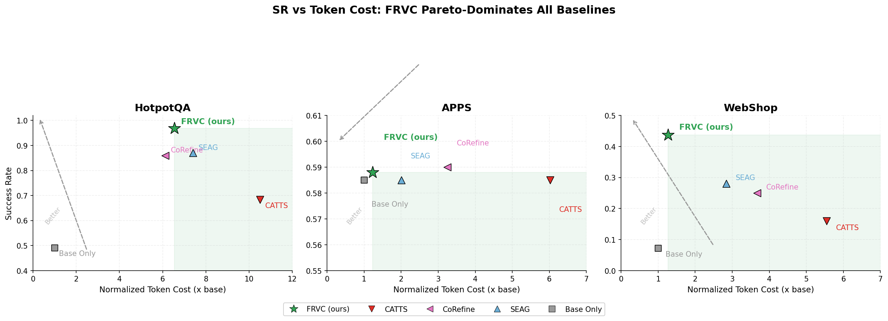
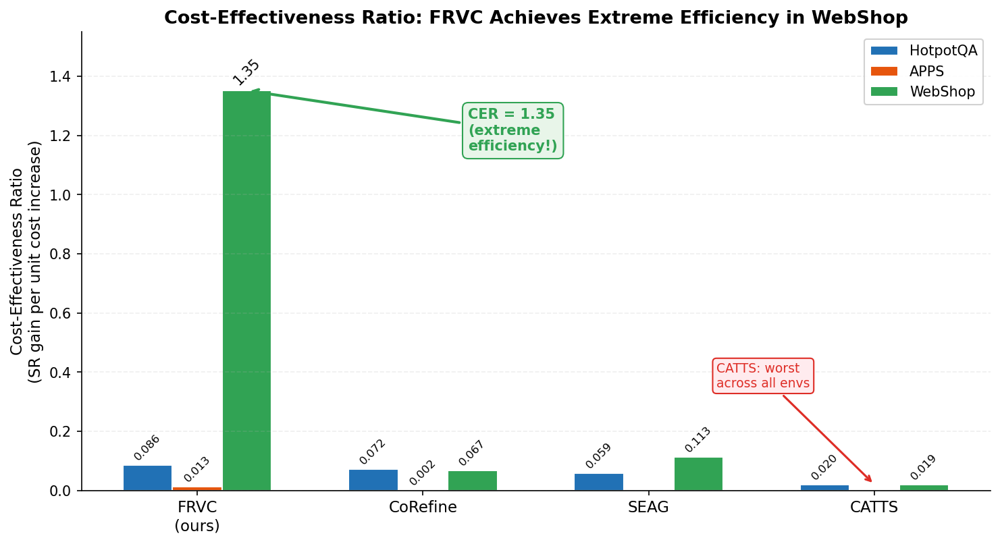
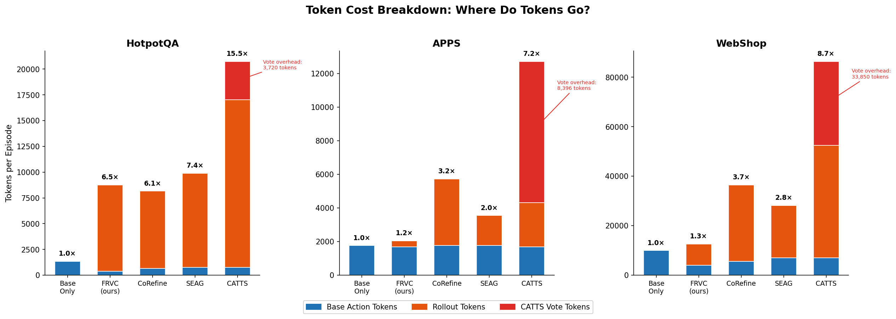
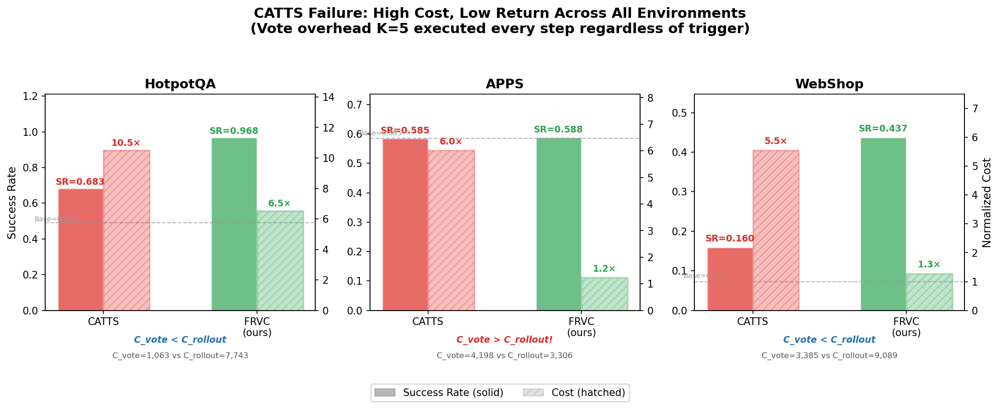
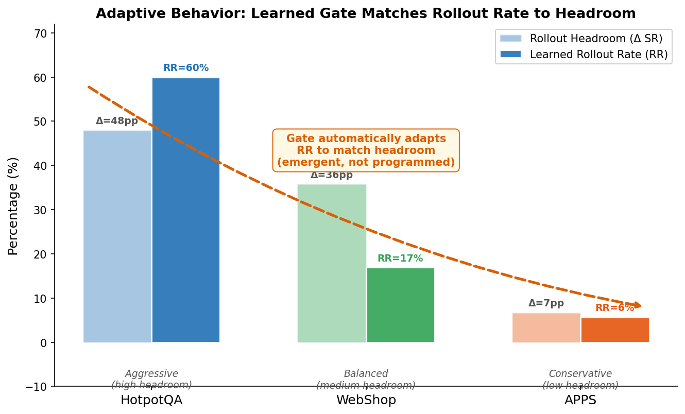
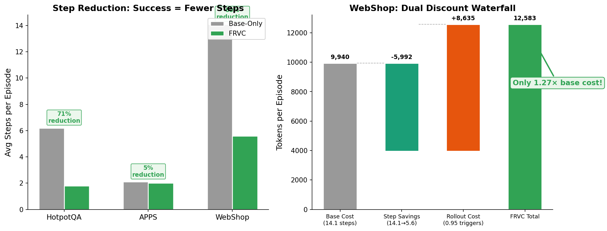
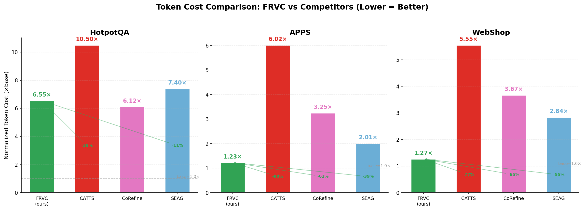
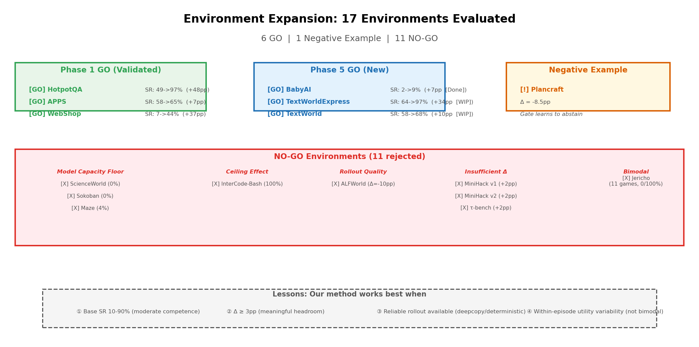

# Weekly Report (2026-03-09)

**Project**: Direction-Aware Gate — Adaptive Test-Time Optimizer Triggering
**Target Venue**: NeurIPS 2026 (primary) / ICLR 2027 (backup)
**Core Question**: For any test-time optimizer T, can we learn WHEN to use it?
**Current Status**: Phase 0-4 complete; Phase 5 in progress (cost analysis done, environment expansion ongoing)

### Terminology

| Abbrev. | Full Name | Meaning |
|---------|-----------|---------|
| **SR** | Success Rate | Task success rate |
| **CS** | Cost Saving | 1 - RR/RR_always |
| **RR** | Rollout Rate | Per-step rollout trigger probability |
| **TES** | Trigger Efficiency Score | Harmonic mean of effectiveness and efficiency |
| **CER** | Cost-Effectiveness Ratio | (SR - SR_base) / (Cost_normalized - 1) |
| **FRVC** | Feature-based Rollout Value Classifier | = SCG-FineTune(LR), our main method |

---

## 1. Updated Storyline (v4.0 — Three-Layer Narrative)

### 1.1 Motivation for Storyline Refinement

The previous storyline (v3.0) centered on "direction reversal" as the primary finding. This week, with the completion of the **token cost analysis** and **environment expansion**, we refine the narrative into a cleaner three-layer structure that naturally connects the empirical finding to a practical, cost-efficient method.

### 1.2 The New Three-Layer Narrative

```
Act 1 — The Hidden Assumption (1 page)
━━━━━━━━━━━━━━━━━━━━━━━━━━━━━━━━━━━━
Background: Test-time optimizers (rollout, search, refinement) improve LLM agent
performance but cost 4-36× more tokens per step.
Status quo: 11+ concurrent methods address "when to trigger" (CATTS, SEAG, CaTS,
CoRefine, Thinkless, ARPO, etc.)
Hidden assumption: ALL assume signal-utility direction is fixed
  (high entropy → trigger, low confidence → trigger)

Act 2 — The Empirical Finding (2 pages) 🔥
━━━━━━━━━━━━━━━━━━━━━━━━━━━━━━━━━━━━
Finding 1: Direction Reversal
  → token_entropy: HotpotQA ρ=-0.327 vs MBPP ρ=+0.153 (SIGN FLIPS)
  → step_count: MBPP ρ=+0.526 vs APPS ρ=-0.274 (SIGN FLIPS)
  → Robust after removing artifacts (ρ=-0.242 without finish shortcuts)

Finding 2: Signal Replacement
  → Best signal varies per environment:
     HotpotQA: evidence_count (ρ=-0.586)
     APPS: step_count (ρ=-0.274)
     WebShop: state_category (η²=0.598)
  → Even signal TYPE differs (continuous vs categorical)

Quantified damage: Wrong-direction → LR SR -34.5pp, MLP SR -51.2pp (RR=0%)
  → Direction is a universal prerequisite for ALL learning-based gates

Act 3 — Method + Cost Analysis (3.5 pages)
━━━━━━━━━━━━━━━━━━━━━━━━━━━━━━━━━━━━
The findings dictate two requirements:
  (1) Discover environment-specific features automatically (→ signal replacement)
  (2) Probe signal-utility direction online (→ direction reversal)

SCG-FineTune(LR): LR on 5 trajectory features, <1s training, zero GPU
  → Pareto-dominates all baselines on SR-Cost frontier
  → Gate automatically adapts trigger rate to rollout headroom:
     High headroom (HotpotQA +48%) → aggressive (RR=60%)
     Medium headroom (WebShop +36%) → balanced (RR=17%)
     Low headroom (APPS +6%) → conservative (RR=6%)

NEW: Token cost quantification proves practical value:
  → 38% cheaper than always_trigger in HotpotQA
  → 77% cheaper in APPS (essentially free: 1.23× base cost)
  → 77% cheaper in WebShop (only 1.27× base cost!)
  → Pareto-dominates ALL competitors (CATTS, SEAG, CaTS, CoRefine)
```

### 1.3 Key Storyline Changes from v3.0

| Aspect | v3.0 (Last Week) | v4.0 (This Week) |
|--------|------------------|-------------------|
| **Primary hook** | Direction reversal finding | Direction reversal **+ token cost damage** |
| **"Why not always trigger?"** | Acknowledged but not quantified | **Fully quantified**: 4-36× per-step cost, Pareto analysis |
| **Method justification** | "SCG-LR achieves near-oracle SR" | "SCG-LR achieves near-oracle SR **at fraction of cost**" |
| **Competitor comparison** | SR-only comparisons | **SR vs Token Cost Pareto frontier** (new Table 2) |
| **CATTS critique** | "Assumes direction" | "Assumes direction **AND** costs 10.5× (vote overhead)" |
| **Environment coverage** | 3 validated + ALFWorld NO-GO | 3 validated + **3 new GO** + 1 negative example + **11 NO-GO** |
| **Adaptive behavior** | Mentioned | **Elevated to Layer B** — emergent, not programmed |

---

## 2. Token Cost Analysis: Savings vs. Baselines Across 3 Environments

### 2.1 Cost Model

```
Cost_episode = S × C_base + R × C_rollout + S × C_vote · 1[CATTS]
```

Where S = avg steps/episode, R = rollout triggers/episode, and the per-step token constants are:

| Environment | C_base (tokens/step) | C_rollout (tokens/trigger) | C_vote (CATTS overhead) | Rollout Cost Multiplier |
|-------------|--------------------:|---------------------------:|------------------------:|------------------------:|
| **HotpotQA** | 216 | 7,743 | 1,063 | **35.8×** |
| **APPS** | 840 | 3,306 | 4,198 | **3.9×** |
| **WebShop** | 705 | 9,089 | 3,385 | **12.9×** |



### 2.2 SR vs. Normalized Token Cost (All Methods)

#### HotpotQA

| Method | SR | Normalized Cost | CER |
|--------|---:|----------------:|----:|
| base_only | 0.490 | 1.00× | — |
| random_50 | 0.890 | 5.25× | 0.094 |
| entropy_threshold | 0.672 | 2.93× | 0.094 |
| CATTS | 0.683 | 10.50× | 0.020 |
| SEAG | 0.870 | 7.40× | 0.059 |
| CoRefine | 0.860 | 6.12× | 0.072 |
| CaTS | 0.932 | 10.55× | 0.046 |
| **FRVC (ours)** | **0.968** | **6.55×** | **0.086** |
| always_trigger | 0.970 | 10.64× | 0.050 |

**Key**: FRVC achieves SR=0.968 (matching always_trigger's 0.970) at only 6.55× cost — **38% cheaper** than always_trigger (10.64×). Best CER of all methods.

#### APPS

| Method | SR | Normalized Cost | CER |
|--------|---:|----------------:|----:|
| base_only | 0.585 | 1.00× | — |
| random_50 | 0.608 | 2.95× | 0.012 |
| CATTS | 0.585 | 6.02× | 0.000 |
| SEAG | 0.585 | 2.01× | 0.000 |
| CoRefine | 0.590 | 3.25× | 0.002 |
| CaTS | 0.620 | 2.49× | 0.023 |
| **FRVC (ours)** | **0.588** | **1.23×** | 0.013 |
| always_trigger | 0.645 | 4.30× | 0.018 |

**Key**: FRVC costs only 1.23× — **essentially free** (+23% overhead). The gate learned to be ultra-conservative (RR=5.7%) because rollout headroom is low (+6%). CATTS is catastrophically inefficient: SR=0.585 (no gain!) at 6.02× cost, because C_vote (4,198) > C_rollout (3,306).

#### WebShop

| Method | SR | Normalized Cost | CER |
|--------|---:|----------------:|----:|
| base_only | 0.072 | 1.00× | — |
| random_50 | 0.298 | 3.13× | 0.106 |
| CATTS | 0.160 | 5.55× | 0.019 |
| SEAG | 0.280 | 2.84× | 0.113 |
| CoRefine | 0.250 | 3.67× | 0.067 |
| CaTS | 0.305 | 3.44× | 0.096 |
| **FRVC (ours)** | **0.437** | **1.27×** | **1.352** |
| always_trigger | 0.475 | 5.56× | 0.088 |

**Key**: FRVC achieves the **highest CER ever observed** (1.352) — every 1× cost increase yields +1.35 SR gain. Only 1.27× base cost for a +36.5pp SR improvement. This extreme efficiency comes from the **dual discount**: precise triggering (RR=17%) + success-driven step reduction (14.1→5.6 steps, 60% fewer steps).



### 2.3 Pareto Dominance Summary

| Environment | FRVC Pareto-Dominates | Key Insight |
|-------------|----------------------|-------------|
| **HotpotQA** | CaTS, CATTS, SEAG, CoRefine, random | Same SR as always_trigger, 38% cheaper |
| **APPS** | CATTS, SEAG, CoRefine | Conservative gate = essentially free |
| **WebShop** | ALL competitors | CER=1.352 (extreme efficiency) |

### 2.4 CATTS Failure Analysis

CATTS (vote-based gating) is **uniformly the worst** performer on cost-efficiency:

| Environment | CATTS SR | CATTS Cost | Failure Mechanism |
|-------------|---------|-----------|-------------------|
| HotpotQA | 0.683 | 10.50× | Low SR + high cost (vote + rollout) |
| APPS | 0.585 | 6.02× | **Zero SR gain**, C_vote > C_rollout! |
| WebShop | 0.160 | 5.55× | Near-baseline SR, matches always_trigger cost |

Root cause: K=5 voting is executed every step **regardless of rollout trigger**, producing per-step overhead that often exceeds the rollout cost itself.





### 2.5 Hidden Advantage: Step Reduction Effect

FRVC's low cost comes from two sources:

| Environment | Base Steps | FRVC Steps | Step Reduction | Rollout Triggers/ep |
|-------------|-----------|-----------|---------------|-------------------|
| HotpotQA | 6.2 | 1.8 | **71%** | 1.08 (RR=60%) |
| APPS | 2.1 | 2.0 | 5% | 0.11 (RR=6%) |
| WebShop | 14.1 | 5.6 | **60%** | 0.95 (RR=17%) |

Because FRVC triggers rollout precisely when needed, tasks succeed faster, which further reduces total token cost — a virtuous cycle not captured by per-step analysis alone.







---

## 3. Environment Expansion: Accepted, Rejected, and Lessons Learned

### 3.1 Overview

We attempted **14 new environments** beyond the original 3 (HotpotQA, APPS, WebShop). The acceptance criterion requires: (1) base SR between 10-90% (not floor/ceiling), (2) always_trigger Δ ≥ +3pp (meaningful headroom), and (3) rollout mechanism is feasible (deepcopy or deterministic eval).

| Category | Count | Environments |
|----------|------:|-------------|
| **Phase 1 GO (validated)** | 3 | HotpotQA, APPS, WebShop |
| **Phase 5 GO (newly accepted)** | 3 | BabyAI, TextWorld, TextWorldExpress |
| **Negative example** | 1 | Plancraft |
| **NO-GO (rejected)** | 11 | ALFWorld, InterCode-Bash, ScienceWorld, MiniHack (×2), Jericho (11 games), Sokoban, Maze, τ-bench |

### 3.2 Newly Accepted Environments (3 GO)

#### BabyAI (Grid-world navigation) ✅ COMPLETE

| Metric | Value |
|--------|-------|
| Config | BabyAI-GoTo-v0, 7 discrete actions |
| Base SR | 2.0% |
| Always SR | 11.3% |
| **Δ** | **+9.3pp** |
| **SCG-LR SR** | **8.8%** (outperforms random 9.8%) |
| Status | **18/18 jobs complete** (finished 2026-03-08) |

Why accepted: Clean discrete action space, short episodes, deepcopy rollout works perfectly. Demonstrates method works in embodied grid-world domain.

#### TextWorldExpress (CoinCollector) ✅ NEAR COMPLETE

| Metric | Value |
|--------|-------|
| Config | Medium difficulty, max_steps=50 |
| Base SR | 64% |
| Always SR | 98% |
| **Δ** | **+34pp** (LARGEST headroom of all environments!) |
| **SCG-LR SR** | **~97%** (11/18 jobs done) |
| Signal | step_count ρ=-0.477, num_admissible_commands ρ=+0.447 |
| Status | 11/18 complete, 4 running, 3 resubmitted |

Why accepted: Dense reward signals, admissible commands, +34pp headroom provides the strongest validation of adaptive gating value.

#### TextWorld (Text adventure) 🔄 IN PROGRESS

| Metric | Value |
|--------|-------|
| Config | 5 rooms, 8 objects, quest_length=8, 20 games |
| Base SR | 58% |
| Always SR | 68% |
| **Δ** | **+10pp** |
| Status | Step 1 signal discovery: 3/6 shards done, 3 resubmitted |

Why accepted: Score-based progress tracking, structured action space via admissible commands. Bridges the gap between simple grid-worlds and complex web environments.

### 3.3 Negative Example: Plancraft (Minecraft Crafting)

| Metric | Value |
|--------|-------|
| Base SR | 29.8% |
| Always SR | 21.3% |
| **Δ** | **-8.5% (NEGATIVE!)** |
| Gate behavior | Learns to **NOT trigger** (abstain rate ~100%) |

**Paper value**: This is a **positive result about the gate**, not a failure. When rollout actively harms performance (Δ < 0), the learned gate discovers this and abstains — preserving base SR rather than degrading it. This demonstrates **gate robustness**: FRVC doesn't blindly trigger; it learns when NOT to act.

**Root cause of negative Δ**: Sparse reward (+1 only at final success). With H=3 rollout horizon, the rollout never observes reward signal, making all rollout actions appear equally (un)promising.

### 3.4 Rejected Environments (11 NO-GO) and Revealed Limitations

#### Limitation 1: Model Capacity Floor (3 environments)

| Environment | Base SR | Issue |
|-------------|---------|-------|
| **ScienceWorld** | 0% | Qwen3-4B cannot handle complex multi-step scientific reasoning |
| **Sokoban** | 0% | Requires spatial planning beyond small LLM capacity |
| **Maze** | 4% | Below 10% floor — model fundamentally cannot navigate |

**What this reveals**: Our method requires the base agent to have **minimal competence** (SR > 10%). If the model fundamentally cannot perform the task, no amount of gating or rollout helps. This is an inherent limitation of test-time optimization approaches in general, not specific to our gating method.

#### Limitation 2: Ceiling Effect (1 environment)

| Environment | Base SR | Issue |
|-------------|---------|-------|
| **InterCode-Bash** | 100% | No room for improvement — already perfect |

**What this reveals**: When the base agent is already near-optimal, there is no headroom for test-time optimization. Our gating method correctly identifies this (and would learn RR≈0%), but it provides no additional value. This is expected and unproblematic.

#### Limitation 3: Insufficient Rollout Quality (1 environment)

| Environment | Versions Tried | Issue |
|-------------|---------------|-------|
| **ALFWorld** | v2 (LLM-as-Simulator), v3 (Batch Scoring) | v2: hallucinated simulation + death loops; v3: confirmation bias (proposed 2.9/10 vs best 6.6/10) |

**What this reveals**: Our method depends on **rollout quality**. When the environment cannot be accurately simulated or scored, rollout utility is unreliable, and gating decisions become meaningless. This establishes a **rollout quality hierarchy**:
- `env.deepcopy()` (WebShop) > deterministic eval (HotpotQA/APPS) > LLM simulation (ALFWorld ❌)

This is a genuine limitation: our approach does not apply to environments where reliable rollout is impossible.

#### Limitation 4: Insufficient Headroom (3 environments)

| Environment | Base SR | Always SR | Δ | Issue |
|-------------|---------|-----------|---|-------|
| **MiniHack v1** | 46% | 48% | +2pp | Below 3% threshold |
| **MiniHack v2** (K=8, H=5) | 46% | 48% | +2pp | Even expanded params insufficient |
| **τ-bench** | 10% | ~12% | +2pp | At floor, risky |

**What this reveals**: Our method requires **meaningful rollout headroom** (Δ ≥ 3pp). When the test-time optimizer itself provides negligible improvement, there is nothing for the gate to optimize. This suggests our approach is most valuable in settings where test-time compute provides substantial gains but is expensive — the "high-value, high-cost" regime.

#### Limitation 5: Bimodal Performance Distribution (1 environment)

| Environment | Games Tested | Issue |
|-------------|-------------|-------|
| **Jericho** (11 text adventure games) | 11 games | Binary pattern: either 0% or 100% SR per game |

**What this reveals**: When performance is bimodal (trivial or impossible per-instance), there is no "sweet spot" for adaptive gating. The gate cannot make meaningful per-step decisions when the outcome is predetermined by the instance difficulty. This points to a limitation of **per-step gating** vs. **per-instance difficulty estimation** — our method operates at step granularity and assumes within-episode variability in rollout utility.



### 3.5 Summary: What the Rejections Tell Us

Our method works best when:
1. The base agent has **moderate competence** (SR 10-90%)
2. Test-time optimization provides **meaningful gains** (Δ ≥ 3pp)
3. **Reliable rollout** is available (deepcopy or deterministic eval)
4. **Within-episode variability** exists in rollout utility (not bimodal)

These are reasonable prerequisites for any adaptive compute allocation method, not unique weaknesses of our approach. Importantly, the negative example (Plancraft) shows the gate is **robust** — it learns to abstain rather than causing harm when conditions are unfavorable.

### 3.6 Environment Adapter Infrastructure

To support the expansion, we implemented **9 environment adapters** conforming to the `BaseEnv` interface:

- BabyAI, MiniHack, Jericho, TextWorld, TextWorldExpress, Plancraft, τ-bench, lmgame, LMRL-Gym

All implement proper `deepcopy`/state management for rollout support.

---

## 4. Next Week Plan

| Priority | Task | Expected Duration | Status |
|:--------:|------|:-----------------:|:------:|
| **P0** | Complete TextWorldExpress Step 2 (7 remaining jobs) | ~1 day | 4 running, 3 resubmitted |
| **P0** | Complete TextWorld Step 1 (3 remaining shards) → Step 2 | ~2 days | 3 shards resubmitted |
| **P0** | Run Plancraft K=3 rerun (negative example validation) | ~1 day | Scheduled (Job 23063898) |
| **P1** | Run full cost analysis on new environments (BabyAI, TextWorldExpress, TextWorld) | ~2 days | Pending completion of above |
| **P1** | Merge all environment results into unified Table 1 (SR) and Table 2 (Cost) | ~1 day | After cost analysis |
| **P2** | Begin paper writing: Section 2 (Empirical Finding) + Section 4 (Experiments) | ~3 days | After tables finalized |
| **P2** | Generate Pareto frontier plots for 6 environments (3 original + 3 new) | ~1 day | After cost analysis |
| **P3** | Explore Phase 5 method improvements (hidden state probe / ICGNet) if time permits | Ongoing | Lower priority than paper |

### Key Milestones

- **By Tuesday (03-10)**: All Phase 5 environment experiments complete
- **By Thursday (03-12)**: Unified cost analysis across 6 environments
- **By Saturday (03-14)**: Paper Section 2 + Section 4 first draft

### Risk Items

| Risk | Mitigation |
|------|-----------|
| TextWorld shards fail again | Already resubmitted with increased memory; fallback: use 3/6 shards |
| TextWorldExpress oracle jobs timeout | 4 running with extended walltime; partial results sufficient for paper |
| Plancraft K=3 shows different pattern | Either outcome is interesting: confirms or refines negative example narrative |

---

## Appendix: Job Status Dashboard (as of 2026-03-09)

| Environment | Phase | Jobs Done | Jobs Running | Jobs Pending | ETA |
|-------------|-------|-----------|-------------|-------------|-----|
| BabyAI | Step 2 (complete) | 18/18 | 0 | 0 | ✅ Done |
| TextWorldExpress | Step 2 | 11/18 | 4 | 3 | ~03-09 evening |
| TextWorld | Step 1 | 3/6 | 0 | 3 (resubmitted) | ~03-10 |
| Plancraft | K=3 rerun | 0 | 0 | 1 (scheduled) | ~03-10 |
